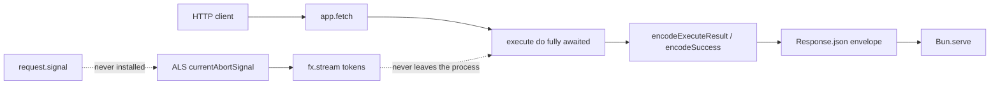

# AI-native backend: current state and closure plan

Investigation only. No implementation in this round. Findings below are from source, not assumption.

## What is already real




- `**fx.stream` is real** — token-by-token from OpenAI-compatible SSE / Ollama NDJSON, cancelled via ambient ALS + a local `AbortController` (`[src/kernel/fx.ts](src/kernel/fx.ts)` ~1824–1854, `[src/drivers/ai-openai-compatible.ts](src/drivers/ai-openai-compatible.ts)` ~144–158).
- **HTTP delivery is not** — `do` is awaited to completion, then `[encodeSuccess](src/compiler/response.ts)` builds a buffered `Response.json({ data, error: null })`. The client SDK always `decode()`s a JSON envelope (`[src/client/transport.ts](src/client/transport.ts)`).
- `**fx.ask` already has a `via` fallback chain** — ordered logical models, same-model retry on 429/5xx, journaled attempts, Console projection. This is not a greenfield gap.
- **JournalSuspend is time-sleep only** — not human-approval resume.
- **MCP in this repo is a server** — operator Console/docs JSON-RPC. There is no MCP client.

---

## 1. HTTP streaming delivery — confirmed gap, design the fix

### Real current path

`[app.fetch](src/kernel/app.ts)` (~1725–1889) matches a route, `await execute(...)`, then `respond(encodeExecuteResult(result))`.

`[runPipeline](src/kernel/hooks.ts)` awaits `handler()` (the flow `do`). After it settles:

- a branded `fx.json.*` carrier or plain value becomes JSON via `[encodeSuccess](src/compiler/response.ts)`
- a raw `Response` is already passed through (`output instanceof Response` at hooks.ts:203–205; `encodeExecuteResult` returns `result.response` first)

So a flow that `return new Response(readable, { headers: { "content-type": "text/event-stream" } })` would already leave the encoder intact. That is **not** a supported public API:

- Journal / Runs commit when `do` returns — before the stream finishes (`[app.ts](src/kernel/app.ts)` ~1503–1527).
- `execute` never installs `request.signal` (see item 2).
- Compiler / Manifest / `createClient` have no stream mode (`[src/kernel/flow.ts](src/kernel/flow.ts)` `FlowOptions` has `out`, `live`, `durable` — no stream).
- `http.get().live()` / `flow({ live: true })` is a **live-query flag** for GET push, not AI token SSE.

Dev pretty-print (`[asBrowserJsonCodeBlock](src/runtime/json-code-block.ts)`) only rewrites `GET` + `application/json` + HTML Accept. `text/event-stream` would pass through. `failureDetailFromResponse` clones and only reads status ≥ 400 JSON — also safe.

**Bun-native mechanism:** `new Response(new ReadableStream({ pull, cancel }), { headers: { "content-type": "text/event-stream", "cache-control": "no-cache" } })`. `Bun.serve` already forwards whatever `app.fetch` returns (`[src/runtime/bun.ts](src/runtime/bun.ts)`). No new runtime adapter.

### Recommended API (reuse `fx.json`, do not invent `fx.http`)

The existing HTTP-response convention is the branded carrier `[fx.json.ok` / `create` / `empty` / `with](src/kernel/fx.ts)` — not a flow-option enum, not a raw `Response`, and there is no `fx.http` namespace.

```ts
on(http.post("/complete").gate.public, flow("chat.complete", {
  do: async (input, fx) => {
    return fx.json.stream(fx.stream(smart, { prompt: input.prompt }));
  },
}));
```

- Add `fx.json.stream(iterable)` as a sibling carrier (same brand family, distinct kind).
- `[encodeSuccess](src/compiler/response.ts)` recognizes it and builds the SSE `Response` from a `ReadableStream` that pulls the iterable (`data: ${JSON.stringify(chunk)}\\n\\n`, then a terminal `data: [DONE]`).
- Do **not** overload `flow({ out })` — `out` is a Standard Schema for JSON data.
- Optional later: compiler infers Manifest `stream: true` from the carrier so `createClient` can grow a `.stream()` method. v1 can ship HTTP SSE without client codegen; `fetch` + `ReadableStream` / `EventSource` is enough.

Kernel changes that must accompany the carrier (otherwise the escape-hatch `return new Response` stays incomplete):

- Detect a stream carrier **before** `journalSession.commit("completed")` / Runs record. Either defer those until `ReadableStream` cancel/close, or record `running` and finalize on drain.
- Do not wrap stream responses in `asBrowserJsonCodeBlock` (already skipped by content-type).
- **Skip full-body middleware for `text/event-stream`.** The compression plugin reads `ctx.response.arrayBuffer()` then `Bun.gzipSync` (`[src/plugins/compression.ts](src/plugins/compression.ts)` ~78–86). That would silently buffer an SSE body. Gate on content-type (same class of bug as the HTML pretty-printer).
- Leave the synchronous JSON path untouched: non-stream outputs still hit `encodeSuccess` exactly as today.
- `FlowHandler` is typed as `O | FlowFailure` only — raw `Response` works at runtime in hooks but is not a public contract. Keep the public path as `fx.json.stream`, not `return new Response`.

---

## 2. Client-disconnect cancellation — confirmed gap, design the fix

### Real current abort graph


| Layer                                                 | Signal today                                                                                                                                                                  |
| ----------------------------------------------------- | ----------------------------------------------------------------------------------------------------------------------------------------------------------------------------- |
| Bun `Request.signal`                                  | Exists on the Fetch `Request`. Never read in `[app.ts](src/kernel/app.ts)` / `[execute](src/kernel/app.ts)`.                                                                  |
| ALS `[currentAbortSignal](src/kernel/abort-scope.ts)` | Installed only by `fx.all` / `fx.race`. HTTP entry uses `NEVER_ABORTED`.                                                                                                      |
| `[fx.stream](src/kernel/fx.ts)`                       | Links ALS → local `AbortController`, passes `local.signal` to the driver.                                                                                                     |
| `[fx.ask](src/elements/ai/runtime.ts)`                | `mergeAskAbortSignal(timeout)` **only** — comment says “e.g. request cancel” but ambient is never passed (line 597).                                                          |
| Drivers                                               | OpenAI-compatible / Ollama **do** pass `opts.signal` into `fetch`. **Anthropic `complete` ignores it** (`[src/drivers/ai-anthropic.ts](src/drivers/ai-anthropic.ts)` ~39–53). |
| `fx.run` / `toolLoop`                                 | No `signal` forwarded today.                                                                                                                                                  |


`[AiCompleteOptions.signal](src/drivers/ai-types.ts)` is the right plumbing. The missing link is HTTP → ALS → `fx.ask` / `fx.stream`. Bun `Request.signal` was verified locally: client abort during a slow handler fires the server request’s abort listener. The kernel never observes it.

### Design (no per-call AbortController)

1. In `executeInLocale`, when `extras.request` is present, wrap the pipeline in `withAbortSignal(extras.request.signal, ...)`.
2. In `fx.ask`, pass `currentAbortSignal()` into `mergeAskAbortSignal(timeout, ambient)` (already supports `AbortSignal.any`).
3. Same ambient into `fx.run` / `toolLoop`.
4. `fx.stream` already reads ALS — it starts working the moment step 1 exists.
5. Pass `signal` through the Anthropic driver `fetch` (parity with OpenAI-compatible / Ollama).
6. SSE `ReadableStream.cancel` should also `local.abort()` as a backstop after the `Response` is handed to Bun.
7. **Treat disconnect abort as non-retryable.** `isRetryableAiError` currently returns true for `AbortError` (`[src/elements/ai/errors.ts](src/elements/ai/errors.ts)` ~77). After wiring, a client hang-up would otherwise retry the same model and then advance `via` — more tokens after the response is unobservable. Distinguish timeout (retryable) from cancel (stop).

**Real test:** HTTP client starts `fx.json.stream(fx.stream(...))`, reads one chunk, aborts. Assert the driver’s `fetch` `signal.aborted === true` and no further provider reads / budget burn. Existing `[src/drivers/ai-stream.test.ts](src/drivers/ai-stream.test.ts)` covers ALS abort in-process only — add a `Bun.serve` + `fetch` abort test.

This is the highest-leverage, lowest-effort fix: no new public API if done before or with item 1.

---

## 3. Stream / connection lifecycle decoupling — not a natural Journal extension

### What Journal actually records

`[JournalEntry](src/kernel/journal.ts)` is `step` (completed value) | `sleep` (wakeAt) | `effect` (completed value). Replay returns the stored value and **does not re-execute**.

`fx.stream` today:

```1824:1848:src/kernel/fx.ts
    stream(model, opts) {
      const chunks = (async function* () {
        await gated("ask", name, async () => undefined);
        // ... then yields live tokens, which are NOT journaled
```

`gated` persists `undefined` **before** any token. On durable resume the effect replays as a no-op, then the generator **restarts the provider stream from scratch**. That is the opposite of “pick up mid-generation.”

### Tradeoff


| Path                                 | Reality                                                                                                                                                                                                                                                                    |
| ------------------------------------ | -------------------------------------------------------------------------------------------------------------------------------------------------------------------------------------------------------------------------------------------------------------------------- |
| v1 “stream once, disconnect cancels” | Matches current Journal semantics. Pair with item 2. **Do this.**                                                                                                                                                                                                          |
| Resumable reconnect                  | Needs a **new** journal kind (token prefix / event id), persist cadence, `Last-Event-ID` reconnect, and a client that is not `createClient` today (`[src/client/live-gap.test.ts](src/client/live-gap.test.ts)` documents no SSE). Not a Journal step-recording extension. |


Do not overbuild. Treat resumable streams as a later round if product need appears.

---

## 4. Human-in-the-loop — JournalSuspend is clock sleep only

`[JournalSuspend](src/kernel/journal-suspend.ts)` is a park signal with `label` + `wakeAt`. Thrown only from `[journal.sleep](src/kernel/journal.ts)` (~538–571) for `fx.clock.sleep`. Runner statuses: `running | sleeping | compensating | completed | failed`. There is no `waiting`.

Resume today is **time-based**:

- Clock claims due sleeps (`wakeAt <= now`)
- Console `[wakeEarly](src/elements/clock/actions.ts)` sets `wakeAt` to now. Host `state.wakeEarly` does **not** pass `resolveFlow`, so it often only advances the schedule (`resumed: false`) and waits for the 1s scheduler — still **operator** “wake this sleep,” not “human approved this step”

No `fx.wait`, wait-for-signal, wait-for-approval, or user-plane resume API. Signal triggers start **new** flows; they do not resume a parked journal.

MCP `[createConfirmationGate](src/mcp/confirmation.ts)` is operator confirmation for MCP **write tools** — a different layer.

**Hack that already works:** `fx.clock.sleep("approval", "7d")` + operator `wakeEarly`. Not a product HITL primitive.

**Real gap for HITL:** new journal status (e.g. `waiting`), a suspend reason other than `wakeAt`, and an explicit resume (HTTP / signal / Console) that is first-class — not “sleep a long time.” High effort; separate round. Reuse `runDurable` + lease reclaim; do not reuse `JournalSuspend`’s time fields as the contract.

---

## 5. Native MCP tool support — server exists, client does not

### What exists

`[src/mcp/](src/mcp/)` is a **hand-rolled JSON-RPC 2.0 server** (no `@modelcontextprotocol` SDK): `initialize`, `tools/list`, `tools/call`, `ping` (`[protocol.ts](src/mcp/protocol.ts)`). Surfaces: app MCP `:6535` (Manifest / traces / confirmed invoke), docs MCP `:6536`. Zero MCP client modules.

### How tools work today

`[ai.agent({ tools: [flow, ...] })](src/elements/ai/declare.ts)` and `fx.ask(..., { tools })` dispatch through `callTool → fx.call` (`[src/elements/ai/tools.test.ts](src/elements/ai/tools.test.ts)`). Tools are **this app’s flows**, gated by `effects.calls`. Compiler infers `fx.ask(..., { tools })` → `effects.calls`; it does **not** infer `fx.run` agent tools. `fx.stream` has no tool loop. Anthropic’s driver has no tools parameter. MCP protocol here is `2024-11-05` over `POST /mcp` only.

### Reuse verdict

The MCP **server** does not give a reusable MCP **client**. Shared bits are only the JSON-RPC envelope types. ACL, confirmation phrase, and `asData` envelopes are operator-plane Console policy — wrong shape for model tool results.

**Scope of a real AI MCP client (future round):**

- Declare external servers on the `ai` element (command/URL, auth via `vault`)
- Client session: initialize → tools/list → map into existing `AiToolDef` / `toolLoop`
- `tools/call` over Streamable HTTP or stdio
- Capability tokens so undeclared MCP tools cannot run (same rule as `calls: ["lookup.booking"]`)
- Abort via the same ALS signal as item 2

High effort; do not block v1 streaming on it.

---

## 6. Provider fallback chains — `fx.ask` already has them

### What is real

- App boots **one** protocol driver (`mock` / `anthropic` / `openai-compatible` / `ollama`) in `[resolveAiDriverId](src/kernel/boot-bind/ai.ts)`.
- Logical models can override `baseUrl` / `apiKey` on the same driver.
- `fx.ask` resolves `ask.via ?? prompt.via ?? [prompt.model]`, retries once on the same model (250ms), then advances. 429/5xx retryable; 401/4xx stop (`[src/elements/ai/errors.ts](src/elements/ai/errors.ts)`, tests in `[src/elements/ai.test.ts](src/elements/ai.test.ts)`).
- Attempts are journaled (`AiFallbackAttempt`); Console `projectFallbackChains` already exists.

### Real remaining gaps

- `**fx.stream` / `fx.run` / `embed` have no `via`.**
- `**provider` / `tier` are metadata** — `clientFor()` always uses `defaultDriver`.
- **Budget is observe-only** — `maxCostPerCall` / `maxCostPerRun` are declared and shown as `overBudgetRate`; nothing throws. Drivers mostly report tokens, not USD.

### Design that reuses `via` (does not invent a second fallback)

- Keep fallback as **ordered logical model names** (already the convention, already capability-safe).
- Optional: per-model `driverId` so `clientFor` can open anthropic then ollama without a process-wide driver swap.
- Enforce `decl.budget.maxCostPerCall` inside the existing ask attempt loop (journal `budget_exceeded`, stop the chain).
- Stream parity is optional and harder (partial tokens); do not block SSE v1 on it.

---

## Prioritized closure


| Priority  | Item                                                          | Impact                                | Effort                                    | Verdict                                                                  |
| --------- | ------------------------------------------------------------- | ------------------------------------- | ----------------------------------------- | ------------------------------------------------------------------------ |
| **P0**    | 2 — Wire `request.signal` → ALS → `fx.ask` / `fx.stream`      | Stops silent token burn on disconnect | Low                                       | Fix first. No new API.                                                   |
| **P0/P1** | 1 — `fx.json.stream` + SSE `ReadableStream` in encode path    | Tokens reach the client               | Medium (kernel dispatch, deferred commit) | Next. Reuse `fx.json`, do not add `fx.http` or `out: "stream"`.          |
| **P2**    | 6 — Budget enforce + optional stream `via` / per-model driver | Completes an existing system          | Low–medium                                | After streaming. Ask fallback already shipped.                           |
| **Later** | 4 — HITL `waiting` + explicit resume                          | Real interrupt-resume                 | High                                      | New journal status. Not `JournalSuspend` overloading.                    |
| **Later** | 5 — MCP **client** as AI tool source                          | External tool ecosystem               | High                                      | Separate from MCP server. Reuse `toolLoop` + capability, not server ACL. |
| **Defer** | 3 — Resumable reconnect                                       | Disconnect/reconnect mid-gen          | High                                      | Not a Journal extension. v1 = stream once + cancel.                      |


### Suggested first implementation slice (when leaving Plan)

1. `withAbortSignal(request.signal)` in HTTP `execute` + pass ALS into `fx.ask` / `fx.run`; Anthropic `fetch({ signal })`; disconnect `AbortError` does not advance `via`.
2. `fx.json.stream` carrier + SSE encoder + deferred durable/Runs finalize; compression plugin skips `text/event-stream`.
3. `Bun.serve` integration test: progressive chunks, then abort → provider `fetch` aborts.
4. Docs: `[site/content/docs/elements/ai.mdx](site/content/docs/elements/ai.mdx)` Streaming section currently stops at in-process `fx.stream`.

Do not touch Manifest codegen, `createClient` SSE, HITL, or MCP client in that slice.