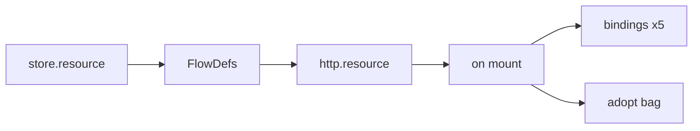

# Final plan: `store.resource` + complete list URL

## Corrections locked

1. **Factory:** nested on `store` — **ten stays ten.** Signature refined below to `store.resource(db, table, opts)`.
2. **v1 list URL is complete:** cursor + offset + search + filters + order + select + CRUD + envelope.
3. **Search ≠ filter**; ColumnScope `"all" | Column[] | "none"`.

---

## Critical review — is this the best shape?

**Verdict:** Direction is right (Flow-native resource + PostgREST-like list URL + OKE envelope). A few adjustments make it tighter and production-safe.

| Topic                        | Current idea                        | Better?                                                        | Decision                                                                                                        |
| ---------------------------- | ----------------------------------- | -------------------------------------------------------------- | --------------------------------------------------------------------------------------------------------------- |
| Store binding                | `store.resource(table, opts)` alone | Flows must call `fx.store(db)` — need the sql decl             | `**store.resource(db, table, opts)**` — mirrors `fx.store(db).…from(table)`                                     |
| Mount sugar                  | `on(http.resource(path, all()))`    | Slightly magical, but returns adopt bag and keeps `on` central | **Keep** as primary; optional `notesR.mount(path)` later as alias only                                          |
| Envelope + meta              | Stripe `{ data, meta?, error }`     | Still best vs bare arrays / nested page-as-data                | **Keep**                                                                                                        |
| Dual page modes              | cursor + offset                     | Needed (infinite vs Table `rowCount`)                          | **Keep both**; docs: TanStack Table admin → **offset**; feeds → **cursor**                                      |
| Offset `COUNT(*)` always     | Expensive on huge tables            | PostgREST made count optional                                  | Add `**list.count: "exact"                                                                                      |
| Filter ops                   | eq/neq/gt/…/like/in/or              | Boolean/null filters need `is`                                 | Add `**is.null` / `is.true` / `is.false**` in v1                                                                |
| `select` vs types            | `?select=` narrows rows             | Client `out` stays full `Note` — TypeScript won’t narrow       | **Ship select as runtime projection**; document that `$routes` `out` remains the full item type (honest caveat) |
| TanStack columnFilters → URL | Unspecified                         | Strings often want `ilike`, ids want `eq`                      | **Document convention** (app maps filters→ops); no official adapter package in this PR                          |
| Scope creep                  | Large surface                       | Still one coherent “list resource”                             | **Ship together** — splitting filter grammar out would force another breaking URL round                         |

**What we are not changing:** freedom hatches, ColumnScope, search≠filter, no top-level `resource`, no embed/Prefer/fts.

### International text (English / Arabic / other) — required in v1

List URLs must work for **multilingual content**, not Latin-only demos.

| Layer                  | Requirement                                                                                                                                                                                                                                                         |
| ---------------------- | ------------------------------------------------------------------------------------------------------------------------------------------------------------------------------------------------------------------------------------------------------------------- |
| Wire                   | Query parser **UTF-8 percent-decodes** values (`?search=%D9%85%D8%B1%D8%AD%D8%A8%D8%A7` → `مرحبا`). No Latin-1 assumptions.                                                                                                                                         |
| Search / filter values | Passed through to SQL as Unicode strings; patterns may contain Arabic, CJK, emoji, etc.                                                                                                                                                                             |
| Search matching        | Substring match on those strings. **Case-insensitive** where the driver can: Postgres → `ilike`; SQLite → `like` (ASCII casefold only — non-Latin scripts like Arabic have no case, so substring still works). Document the SQLite Unicode casefold limit honestly. |
| `order=`               | Lexicographic order per DB collation (Postgres can use DB/column collation; SQLite default may not be perfect Arabic dictionary order — still deterministic). Optional later: `list.collation` / locale — **not v1**.                                               |
| Identifiers            | Param names & column keys stay **English API identifiers** (`search`, `order`, `title`). Multilingual applies to **values and stored text**, not to renaming the grammar.                                                                                           |
| Errors / envelope      | Codes stay English (`NotFound`, `ValidationError`); messages may remain English in v1 (i18n of error copy is a separate concern).                                                                                                                                   |
| Tests                  | Notes (or resource unit tests) include **Arabic + English** `search` / `eq` / `ilike` round-trips.                                                                                                                                                                  |

**Out of v1 for i18n:** full ICU on SQLite, Accept-Language-driven collation, translated error messages, RTL-specific API behavior.

---

## Analysis (abbreviated)

| Topic          | Locked choice                                                                |
| -------------- | ---------------------------------------------------------------------------- |
| Factory        | `store.resource(db, table, opts)`                                            |
| Mount sugar    | `on(http.resource("/notes", notesR.all()))` → five Bindings; returns ops bag |
| Method names   | `list` / `get` / `create` / `update` / `remove`                              |
| Envelope       | `{ data, meta?, error }`                                                     |
| Page modes     | `"cursor"`                                                                   |
| Hybrid freedom | Granular `on` + manual Flows + `page(..., { where })`                        |

---

## Locked DX

### `store.resource` options

```ts
import { store, on, http, oke } from "okengine";
import { db } from "../core";
import { notes as notesTable } from "../schema";

const notesR = store.resource(db, notesTable, {
  // —— contracts (same as flow({ in, out, errors })) ——
  in: NewNote,
  out: Note,
  update: NewNote.partial(), // optional; default = partial of `in` (HTTP still PATCH)
  errors: { NotFound }, // optional; default empty NotFound

  id: notesTable.id, // optional; default = table PK

  list: {
    mode: "cursor", // "cursor" | "offset" — Notes teaches cursor; admin tables often "offset"
    cursor: [notesTable.createdAt, notesTable.id],
    direction: "desc",
    limit: 20,
    maxLimit: 100,
    count: "exact", // offset only: "exact" | "none" — default "exact"

    // ColumnScope: "all" | readonly Column[] | "none"
    search: [notesTable.title],
    filter: "all",
    order: "all",
    select: "all", // runtime projection; client out type stays full Note
  },

  unit: "notes",
});

export const notes = on(http.resource("/notes", notesR.all()));
```

### Column scope — one pattern everywhere

For `list.search`, `list.filter`, `list.order`, and `list.select`:

```ts
type ColumnScope =
  | "all" // every scalar column on the table
  | readonly Column[] // explicit allow-list
  | "none"; // feature off — related URL params → 422
```

| Value      | Meaning                                                                                |
| ---------- | -------------------------------------------------------------------------------------- |
| `"all"`    | Full control — any table scalar field allowed for that concern                         |
| `[col, …]` | Only these fields                                                                      |
| `"none"`   | Without — that concern disabled (no search / no filters / no client order / no select) |

**Defaults (safe):**

| Option        | Default                                                                                                                                                           |
| ------------- | ----------------------------------------------------------------------------------------------------------------------------------------------------------------- |
| `list.search` | `"none"`                                                                                                                                                          |
| `list.filter` | `"none"`                                                                                                                                                          |
| `list.order`  | If unset: allow `?order=` on `list.cursor` columns when present, otherwise `"all"`. Use `"none"` to forbid client order (server still sorts by cursor+direction). |
| `list.select` | `"all"` — omit `?select=` returns full `out`; with `?select=` only scoped columns                                                                                 |

Notes teaching default:

```ts
const notesR = store.resource(db, notesTable, {
  in: NewNote,
  out: Note,
  list: {
    cursor: [notesTable.createdAt, notesTable.id],
    search: [notesTable.title],
    filter: "all",
    order: "all",
  },
});
```

Lock filters off: `filter: "none"`. Skip COUNT on huge offset lists: `count: "none"`.

### Full options reference

| Option                    | Required    | Default                      | Meaning                                                          |
| ------------------------- | ----------- | ---------------------------- | ---------------------------------------------------------------- |
| _(arg)_ `db`              | yes         | —                            | Sql `StoreDecl` (`store.sql(...)`)                               |
| _(arg)_ `table`           | yes         | —                            | Drizzle / schema table                                           |
| `in` / `out`              | yes         | —                            | Create / item schemas                                            |
| `update`                  | no          | partial of `in`              | Update body schema; wire remains `http.patch` / `notes.update()` |
| `errors`                  | no          | `{ NotFound: z.object({}) }` | get/update/remove errors                                         |
| `id`                      | no          | table PK                     | `:id` column                                                     |
| `list.mode`               | no          | `"cursor"` if `cursor` set   | Pagination                                                       |
| `list.cursor`             | cursor mode | —                            | Keyset columns                                                   |
| `list.direction`          | no          | `"desc"`                     | Default sort when no `?order=`                                   |
| `list.limit` / `maxLimit` | no          | `20` / `100`                 | Page size                                                        |
| `list.count`              | no          | `"exact"`                    | Offset only — run `COUNT(*)` into `meta.total` or skip           |
| `list.search`             | no          | `"none"`                     | ColumnScope — substring **search**                               |
| `list.filter`             | no          | `"none"`                     | ColumnScope — **filter** grammar                                 |
| `list.order`              | no          | cursor cols, else `"all"`    | ColumnScope — `?order=`                                          |
| `list.select`             | no          | `"all"`                      | ColumnScope — runtime `?select=` (types stay full `out`)         |
| `unit`                    | no          | table name                   | `flow.name` prefix                                               |

**Still deferred:** embed, Prefer headers, fts/range exotic ops (not the column-scope control above).

### Mount → verbs

| Op     | Trigger             |
| ------ | ------------------- |
| list   | `GET /notes`        |
| create | `POST /notes`       |
| get    | `GET /notes/:id`    |
| update | `PATCH /notes/:id`  |
| remove | `DELETE /notes/:id` |

### Complete list URL (v1)

**Reserved params:** `cursor`, `limit`, `offset`, `search`, `q`, `order`, `select`, `or`, `and`.

**Search** (substring; values are UTF-8 — English, Arabic, etc.):

| URL                                     | Behavior                                        |
| --------------------------------------- | ----------------------------------------------- |
| `?search=hello`                         | `like`/`ilike` across `list.search` columns     |
| `?search=مرحبا` / percent-encoded UTF-8 | Same — Unicode values, no Latin-only assumption |
| `?q=hello`                              | Alias of `search` (wire only)                   |
| both present                            | **422**                                         |

**Filters** (column operators — PostgREST-shaped, whitelist via `list.filter`):

| URL                                        | Meaning                        |
| ------------------------------------------ | ------------------------------ |
| `?title=eq.Hello`                          | equals                         |
| `?title=neq.x`                             | not equals                     |
| `?createdAt=gt.100` / `gte` / `lt` / `lte` | comparisons                    |
| `?title=like.*hel*` / `ilike.*hel*`        | pattern (`*` → `%`)            |
| `?id=in.(a,b,c)`                           | IN list                        |
| `?done=is.true` / `is.false` / `is.null`   | boolean / null                 |
| `?or=(title.ilike.*a*,title.ilike.*b*)`    | one-level OR group             |
| `?and=(…)`                                 | one-level AND group (explicit) |

Unknown column or unknown op → **422**. Multiple column params AND together by default.

**Order:**

| URL                                     | Behavior                              |
| --------------------------------------- | ------------------------------------- |
| `?order=createdAt.desc,id.asc`          | Columns must be in `list.order` scope |
| omitted                                 | `list.cursor` + `list.direction`      |
| any `?order=` when `list.order: "none"` | **422**                               |

**Select (projection):**

| URL                                   | Behavior                                                               |
| ------------------------------------- | ---------------------------------------------------------------------- |
| omitted                               | All fields from `out` (when `list.select` is `"all"` or includes them) |
| `?select=id,title`                    | Only listed columns; must be inside `list.select` scope                |
| `?select=` when `list.select: "none"` | **422**                                                                |

**Page:**

| URL                   | Behavior             |
| --------------------- | -------------------- |
| `?cursor=…&limit=20`  | Keyset (cursor mode) |
| `?offset=40&limit=20` | Offset mode          |

Example:

```http
GET /notes?search=hello&createdAt=gte.1700000000&order=createdAt.desc,id.desc&limit=20
GET /notes?search=مرحبا&limit=20
GET /notes?title=ilike.*draft*&cursor=…&limit=10
GET /notes?title=eq.ملاحظة
```

### Freedom preserved

```ts
on(http.get("/notes"), notesR.list());           // granular
on(http.post("/notes"), flow({ /* manual */ })); // full freedom
await fx.store(db).page(notesR, input, { where: eq(...) }); // extra AND filter
return note; // bare ok
```

---

## System integration



| Concern       | Behavior                                    |
| ------------- | ------------------------------------------- |
| Ten exports   | Unchanged — nest under `store`              |
| Registry      | Five bindings before `oke()`                |
| Extract       | Support `on(http.resource(...))` this PR    |
| `on` overload | Branded `ResourceMount` → five single-binds |

---

## `fx.json` + `page`

```ts
fx.json.ok(pageResult); // 200 + meta
fx.json.create(value); // 201
fx.json.empty(); // 204
```

`page()` composes: keyset/offset + `search` + parsed **filters** + `order` + `extra.where`, by building **real `drizzle-orm` operators** and running them through the existing `compileWhere` / fluent `select().from().where().orderBy().limit()` path (effect inference stays on Drizzle shapes).

Meta (cursor): `{ mode, limit, order, nextCursor, hasNextPage }`.

---

## Drizzle harmony + feasibility (verified)

Checked against [Drizzle ORM docs](https://orm.drizzle.team/) (filters, select, limit/offset pagination) and OKE Store (`sql-condition` / `sql-session` / spec commitment to Drizzle).

**Project law (already locked in spec):** Drizzle is a required peer — schema, `eq`/`and`/…, and `drizzle-zod` stay app-owned. OKE duck-types `queryChunks` and compiles to bound SQL; it does **not** invent a second query language. `store.resource` / `page()` must stay sugar that ends in the same Drizzle ops + `fx.store(db)` chain.

| URL / plan op         | Drizzle export                                                                               | OKE compiler today                                            |
| --------------------- | -------------------------------------------------------------------------------------------- | ------------------------------------------------------------- |
| `eq` / `neq`          | `eq` / `ne`                                                                                  | yes                                                           |
| `gt` `gte` `lt` `lte` | same names                                                                                   | yes                                                           |
| `like` / `ilike`      | `like` / `ilike`                                                                             | yes                                                           |
| `or` / `and`          | `or` / `and`                                                                                 | yes                                                           |
| `order` asc/desc      | `asc` / `desc`                                                                               | yes                                                           |
| `select` / `limit`    | `.select()` / `.limit()`                                                                     | yes                                                           |
| `in`                  | `inArray`                                                                                    | **missing — add**                                             |
| `is.null` / not       | `isNull` / `isNotNull`                                                                       | **missing — add** (`is.true`/`false` → `eq(col, true/false)`) |
| `offset`              | `.offset(n)` ([Drizzle guide](https://orm.drizzle.team/docs/guides/limit-offset-pagination)) | **missing — add** on session + memory                         |
| cursor / keyset       | compose `or`/`and`/`lt`/`eq` (Drizzle recommends cursor for large/shifting data)             | pattern proven in `sql-session.test.ts`; wrap as `page()`     |

**Harmonious:** PostgREST-shaped **URL** → map to Drizzle ops → existing compiler. Naming on the wire can stay `neq`/`in`/`is`; runtime uses Drizzle’s `ne`/`inArray`/`isNull`.

**Feasible in this PR** if we ship the three compiler/session gaps (`inArray`, `isNull`/`isNotNull`, `.offset`) plus the URL→ops translator and `page()` keyset helper. No fork of Drizzle; no relational-query API required for v1.

**Dialect honesty (already in i18n section):** Postgres `ilike` is true CI; SQLite `LIKE` is ASCII-CI — same as Drizzle’s dialect reality when apps use those ops.

**Out of scope / not Drizzle conflicts:** embed/joins via relational `db.query`, Prefer headers, FTS — those would be new physics, not missing Drizzle bindings.

---

## Notes rewrite + tests

```ts
const notesR = store.resource(db, notesTable, { in, out, list: { cursor, search, filter, order } });
export const notes = on(http.resource("/notes", notesR.all()));
```

Prove: cursor, `search`/`q`, **filter ops**, `order`, `select`, ColumnScope `"none"` → 422, CRUD envelopes (201 / 200+meta / 204), `NotFound` (400 today), 422 on bad col/op, **Arabic + English** search/filter value round-trips.

Docs in `[four-applications.md](docs/spec/four-applications.md)`: complete URL cheat-sheet; search vs filter called out; Unicode/i18n note (UTF-8 values; SQLite ASCII casefold limit).

---

## Site docs (required)

The public docs site (`[site/](site/)`) **transcludes** canonical `docs/spec/*.md` via `[site/scripts/sync-content.ts](site/scripts/sync-content.ts)` — it must not invent a second story.

1. Land the Notes / list-URL / `store.resource` / `fx.json` story in the spec first (`four-applications.md`; Store reference if the element page needs a short `store.resource` pointer).
2. Run `bun scripts/sync-content.ts` from `site/` so generated pages update — especially `site/content/docs/learn/notes.md` and store-related docs.
3. Spot-check: Notes teach path shows `store.resource` + `on(http.resource)`, Stripe envelope, list URL cheat-sheet, multilingual search note.
4. If any hand-authored site MDX (not synced) still shows the old hand-rolled cursor/`q` Flows, update or remove those snippets so they match the shipped DX.

---

## Gate

`bun test src/kernel src/compiler src/client src/elements/store examples/notes`

## Fit: TanStack Table + TanStack Query

Neither library dictates a backend protocol — they need a **fetchable list API** whose params mirror table state. Mapping:

| Client need (manual* server mode)         | Our list URL / meta                                  | Covered?                           |
| ----------------------------------------- | ---------------------------------------------------- | ---------------------------------- |
| `pagination.pageSize`                     | `?limit=`                                            | yes                                |
| `pagination.pageIndex` (0-based)          | `?offset=pageIndex*limit` when `list.mode: "offset"` | yes                                |
| `rowCount` / `pageCount` for page buttons | offset `meta.total` / `meta.totalPages`              | yes (offset mode)                  |
| Infinite / “load more”                    | cursor `meta.nextCursor` + `meta.hasNextPage`        | yes (cursor mode)                  |
| `sorting: [{ id, desc }]`                 | `?order=id.desc,other.asc`                           | yes                                |
| `globalFilter` string                     | `?search=` / `?q=`                                   | yes                                |
| `columnFilters: [{ id, value }]`          | `?col=eq.value` / `ilike.*x*` / `in.(…)` / `or=(…)`  | yes (client maps value→op)         |
| Column visibility / lean rows             | `?select=` + `list.select` ColumnScope               | yes                                |
| Query cache key                           | `queryKey: ['notes', { limit, offset                 | cursor, order, search, filters }]` |
| `placeholderData: keepPreviousData`       | client-only                                          | n/a                                |
| Mutations + invalidate                    | create/update/remove Flows + client invalidate       | yes                                |

Table: `manualPagination` / `manualSorting` / `manualFiltering`.

**Practical pairing for admin tables:** prefer `list.mode: "offset"` + `count: "exact"` so Table gets `meta.total` → `rowCount`. Use **cursor** with Query `useInfiniteQuery` / load-more UIs. If `count: "none"`, pass `pageCount: -1` on the Table (TanStack allows unknown page count).

**Suggested client mapping** (app-side, not shipped): `SortingState` → `order=id.desc,…`; `globalFilter` → `search=`; each `columnFilters` entry → `col=ilike.*value`* for text or `col=eq.value` for ids/enums.

**Not covered by this API (out of scope — not Table/Query requirements for CRUD lists):**

| Gap                           | Notes                                      |
| ----------------------------- | ------------------------------------------ |
| Faceted filter value lists    | Needs separate aggregate/distinct endpoint |
| Grouping / pivot aggregations | Not a row list                             |
| Nested/expanding related rows | Embed — deferred; use another Flow         |
| Fuzzy / ranking search        | Beyond `like`/`ilike`                      |
| `order=…nullsfirst`           | Optional later polish                      |

**Verdict:** For the common TanStack Table + Query server-driven CRUD table (page, sort, column filters, global search, select), **v1 covers the need**. A thin client helper (map `SortingState` / `ColumnFiltersState` → query string) can live in app code or a later `okengine/client` util — not required to ship the server surface.

---

## Non-goals (this round)

- Top-level `resource` export
- Embed / Prefer / fts / CSV / JSON-path select
- Faceted aggregates / grouping APIs
- Official TanStack adapter package (document the mapping only)
- Shared kernel `NotFound`→404
- Replacing manual Flows for gates, emits, multi-table
