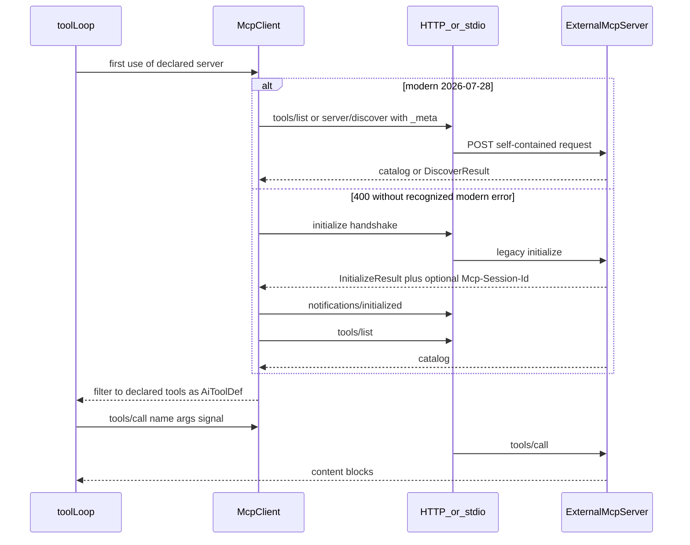
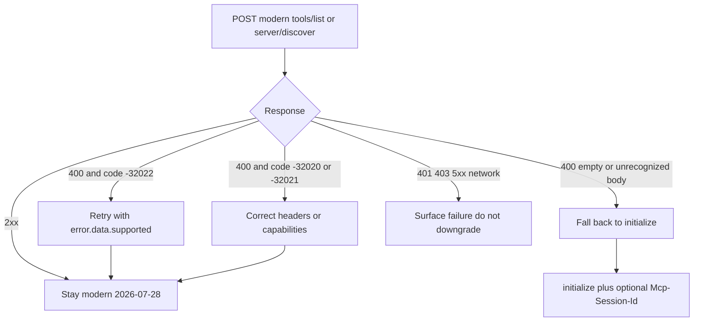
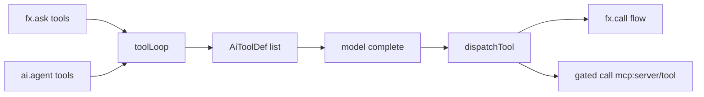

---

name: MCP client design
overview: Promote MCP client support to a dedicated next implementation round. HTTP wire is 2026-07-28 stateless with a legacy handshake fallback. External tools join toolLoop as AiToolDefs (effects.calls / OKE1007). Console treats mcp: refs as AI-element targets — not as missing internal flows — on the graph, Units chips, and traces.
todos:

- id: declare-api
content: Add ai.mcpServer(name, { url | command, auth, tools }) with required allowlist and .tool() NamedRef
status: pending
- id: mcp-client-session
content: "Build caller: per-request _meta (2026-07-28) + era fallback to initialize; Streamable HTTP + stdio; no SDK"
status: pending
- id: toolloop-unify
content: Map mcp:server/tool ↔ server__tool into AiToolDef and dispatch through existing toolLoop / gated call
status: pending
- id: capability-compiler
content: "Stamp manifest.ai.mcpServers; infer effects.calls mcp: refs; OKE1007 for undeclared MCP tools"
status: pending
- id: abort
content: Thread ALS into MCP transport; HTTP cancel = close fetch/SSE stream; stdio = notifications/cancelled then kill
status: pending
- id: tests-docs
content: Mock-transport tests (unified list, drop extras, OKE1007, abort, era fallback) + AI/MCP docs (incl. Console surfaces) + changelog when implementing
status: pending
- id: console-mcp-visibility
content: "Parse mcp:server/tool in graph/Units/traces; AI node + call-edge; chip 'Call github → create_issue'; no dedicated MCP page"
status: pending
isProject: false

---

# MCP Client Integration Design

Investigation and design only. No implementation in this round.

**Amendment (2026-08-20):** Section 2 (Streamable HTTP wire) is rewritten against the [2026-07-28 specification](https://modelcontextprotocol.io/specification/2026-07-28/changelog). The previously approved handshake / `Mcp-Session-Id` “Must” list targeted the **legacy** 2025-11-25 era and must not be implemented as the happy path.

**Amendment (Console):** Section 10 — `mcp:` refs have **zero** special Console handling today and would render as ordinary `call`s (worse: dangling `flow:mcp:…` graph edges). Companion work ships with the implementation round. No dedicated MCP Console page in v1.

**HTTP transport is blocked** until this amendment is the implementation source. stdio process-spawn plumbing and all non-transport design may proceed; stdio still needs per-request `_meta` and a `server/discover` probe (see §2.4) — the handshake is gone from the **protocol core**, not only HTTP.

**Framing (competitor policy):** MCP is an open protocol ([modelcontextprotocol.io](https://modelcontextprotocol.io)), already named and linked from [site/content/docs/ai/mcp.mdx](site/content/docs/ai/mcp.mdx). That is fine. Naming real protocol servers in docs/examples (filesystem, GitHub official MCP, Playwright) is fine — they are not the gated peer frameworks (`Hono` / `Elysia` / `Encore` / `NestJS` / `Fastify` / `Express` / `iii.dev` in [src/cli/competitor-mention-removal.test.ts](src/cli/competitor-mention-removal.test.ts)).

---

## 1. What actually exists in `src/mcp/` (reuse vs build)

The prior “only shared JSON-RPC envelope types” finding is **directionally right, slightly understated**. There is a bit more than the envelope — and almost none of it is usable as a *caller*.

### Reusable as-is (shared wire vocabulary)

From [src/mcp/protocol.ts](src/mcp/protocol.ts):

- `JsonRpcId`, `JsonRpcRequest`, `JsonRpcSuccess`, `JsonRpcError`, `RpcErrorCode`
- `rpcSuccess` / `rpcError` builders
- `parseToolsCallParams` — validates `{ name, arguments }` (useful outbound)

That is the real shared surface.

### Looks reusable, is not (OKE-server-specific)

- `MCP_PROTOCOL_VERSION = "2024-11-05"` — stale. Modern happy path advertises `2026-07-28`. Legacy fallback negotiates `2025-11-25` (or earlier) via `initialize`.
- `McpInitializeResult` — OKE-specific `serverInfo.name` union; puts `sessionId` in the **body**. Spec sessions (legacy era only) live in the `Mcp-Session-Id` **header**. Fallback-only type, and not this shape.
- `parseJsonRpcRequest` — parses **incoming requests**. A client receives **responses**. No `parseJsonRpcResponse` exists.
- `data.ts` (`McpDataEnvelope`, `asData`) — OKE confused-deputy wrapping. Third-party `tools/call` results are MCP content blocks.
- `authorization.ts`, `session.ts`, `confirmation.ts`, `tools.ts`, `server.ts` — responder only.

This project's MCP **server** speaks plain `POST /mcp` → one JSON body. It ignores `initialize` params, never requires `notifications/initialized`, never reads `Mcp-Session-Id`, and never returns SSE. It is closer to the *idea* of stateless POST than to 2025-11-25 sessions — and it is still **not** 2026-07-28 (no `_meta`, no `Mcp-Method` / `Mcp-Name`, no `server/discover`, no `resultType`). Do not treat it as the client target dialect.

### Must be built fresh (caller direction)




New types/modules (no `@modelcontextprotocol/sdk` — same “no SDK” rule as [src/mcp/protocol.ts](src/mcp/protocol.ts)):

- Per-request `_meta` types: `io.modelcontextprotocol/protocolVersion`, `clientCapabilities`, `clientInfo`
- `parseJsonRpcResponse`
- `server/discover` result (`supportedVersions`, capabilities, `resultType`)
- `ToolsListResult` + cursor pagination + `ttlMs` / `cacheScope`
- `ToolsCallResult` — `{ resultType, content, structuredContent?, isError? }`
- Streamable HTTP transport (see §2.2)
- stdio transport (see §2.4)
- **Era detector + cache** (per HTTP origin / stdio process) — not a protocol session
- Legacy-only: `McpInitializeParams` / `InitializeResult` / `Mcp-Session-Id` echo
- Mock transport for tests

---

## 2. Transports — 2026-07-28 wire (this amendment)

The spec still defines **two** official transports: [stdio](https://modelcontextprotocol.io/specification/2026-07-28/basic/transports/stdio) and [Streamable HTTP](https://modelcontextprotocol.io/specification/2026-07-28/basic/transports/streamable-http). HTTP+SSE (2024-11-05) is Deprecated. Clients **SHOULD** support stdio.

Approximate split is unchanged: ~60% stdio-only, ~30% Streamable HTTP (climbing), remainder dual. **v1 still ships both** behind one caller interface.

### 2.1 Wire differences: 2025-11-25 (legacy) vs 2026-07-28 (modern)

Official sources: [changelog](https://modelcontextprotocol.io/specification/2026-07-28/changelog), [versioning](https://modelcontextprotocol.io/specification/2026-07-28/basic/versioning), [SEP-2575](https://github.com/modelcontextprotocol/modelcontextprotocol/pull/2575), [SEP-2567](https://github.com/modelcontextprotocol/modelcontextprotocol/pull/2567).

Terminology from the spec: **Modern** = `2026-07-28` and later (per-request metadata). **Legacy** = `2025-11-25` and earlier (`initialize` handshake). **Dual-era** = implements both.


| Concern                   | 2025-11-25 (legacy)                                                                               | 2026-07-28 (modern)                                                                                                                                                                                                                 |
| ------------------------- | ------------------------------------------------------------------------------------------------- | ----------------------------------------------------------------------------------------------------------------------------------------------------------------------------------------------------------------------------------- |
| Session                   | Optional `Mcp-Session-Id` on initialize; client MUST echo it; 404 → new initialize; DELETE to end | **Removed.** No protocol session. Any instance can serve any request.                                                                                                                                                               |
| Handshake                 | Client MUST `initialize` then `notifications/initialized` before other RPCs                       | **Removed.** There is no connection setup.                                                                                                                                                                                          |
| Version / identity / caps | Exchanged once in initialize                                                                      | On **every** request in `_meta`: `io.modelcontextprotocol/protocolVersion` (required), `clientCapabilities` (required), `clientInfo` (SHOULD). Server SHOULD echo `serverInfo` on results.                                          |
| Capability probe          | Implicit in initialize result                                                                     | `server/discover` — servers MUST implement; clients MAY call it. Not required before `tools/list` / `tools/call`.                                                                                                                   |
| HTTP headers              | `MCP-Protocol-Version` on subsequent requests after initialize                                    | Every POST: `MCP-Protocol-Version` (must match body `_meta`), `Mcp-Method`, and `Mcp-Name` for `tools/call` (and `resources/read` / `prompts/get`). Optional `Mcp-Param-*` from `x-mcp-header`. Mismatch → `-32020` HeaderMismatch. |
| GET / DELETE              | GET opens a standalone SSE listen stream; DELETE ends the session                                 | GET/DELETE are not part of the modern endpoint. Modern-only servers SHOULD 405 them.                                                                                                                                                |
| SSE resume                | `Last-Event-ID` / event ids                                                                       | **Removed.** A broken stream loses the in-flight request; client MUST re-issue with a **new** JSON-RPC id.                                                                                                                          |
| Cancel (HTTP)             | `notifications/cancelled` + disconnect                                                            | **Close the request’s response stream** (`fetch` abort). No `notifications/cancelled` on HTTP.                                                                                                                                      |
| Cancel (stdio)            | `notifications/cancelled`                                                                         | Still `notifications/cancelled` (single shared channel, no per-request stream).                                                                                                                                                     |
| Server→client RPCs        | Allowed on SSE (sampling / elicitation / roots)                                                   | **Removed** from the transport. Replaced by core **MRTR**: `resultType: "input_required"` + retry with `inputResponses`.                                                                                                            |
| `ping`                    | Supported                                                                                         | **Removed.**                                                                                                                                                                                                                        |
| Results                   | No `resultType`                                                                                   | Required `resultType`: `"complete"` or `"input_required"`. Clients MUST treat a missing field as `"complete"` (legacy servers). Unrecognized `resultType` is invalid.                                                               |
| Cross-call app state      | Hidden in the transport session                                                                   | **Explicit-handle pattern** (below).                                                                                                                                                                                                |


**Error-code correction (do not confuse these):**

- Protocol version mismatch is `**UnsupportedProtocolVersionError` = `-32022**` (draft codes `-32004` were renumbered; HTTP status 400). `error.data` is `{ supported: string[], requested: string }`.
- `**-32002` → `-32602**` is real but is **resource not found**, not version negotiation ([changelog minor #6](https://modelcontextprotocol.io/specification/2026-07-28/changelog)). Clients SHOULD still accept `-32002` from older servers for that case. It is **not** the fallback signal.
- Other modern codes: `-32020` HeaderMismatch, `-32021` MissingRequiredClientCapability. These **identify a modern server**.

**Explicit-handle pattern (what replaces implicit session state for a tool-calling client):**

The protocol no longer pins “the conversation” to a transport session. If a server needs state across `tools/call`s, it **mints a handle in a tool result** (a string id the model can see) and the model **passes it back as an ordinary argument** on the next call ([changelog major #1](https://modelcontextprotocol.io/specification/2026-07-28/changelog), [Statelessness](https://modelcontextprotocol.io/specification/2026-07-28/basic#statelessness)).

For our client this is already how `toolLoop` works: tool JSON goes back to the model; the model’s next `arguments` are forwarded verbatim. We do **not** invent MCP session storage, sticky routing, or hidden cookies. We do **not** implement the Tasks extension (`resultType: "task"` / `taskId` polling) in v1 — that is the formalized long-running handle, and it is opt-in (see §2.3).

### 2.2 Streamable HTTP — current Must list (2026-07-28 happy path)

Replace the approved design’s handshake Must list with this:

- Must: one `POST` per JSON-RPC request to the MCP endpoint
- Must: `Accept: application/json, text/event-stream` (both response shapes)
- Must: every request body carries `_meta.io.modelcontextprotocol/protocolVersion` = `"2026-07-28"` and `clientCapabilities` (tools-only; **empty `extensions`** — see §2.3). `clientInfo` SHOULD be `{ name: "okengine", version }`
- Must: headers `MCP-Protocol-Version`, `Mcp-Method`, and `Mcp-Name` on `tools/call`, matching the body. Honor `x-mcp-header` → `Mcp-Param-*` (spec: HTTP clients MUST; drop a tool from the offer list if its annotation is invalid)
- Must: treat HTTP cancel as **aborting the fetch / closing the SSE stream**. Do not POST `notifications/cancelled` on HTTP
- Must: parse `resultType`; missing → `"complete"`; `"input_required"` → fail the tool call loud (v1 does not implement MRTR / elicitation / HITL); any other unrecognized value → invalid
- Must: on a broken SSE stream, re-issue with a **new** request id (no `Last-Event-ID`)
- Must **not** (happy path): `initialize`, `notifications/initialized`, `Mcp-Session-Id`, HTTP GET listen, HTTP DELETE session, `ping`
- May: call `server/discover` first to learn `supportedVersions` and advertised extensions; or go straight to `tools/list`

`tools/list` / `tools/call` remain the only methods we exercise in v1, plus optional `server/discover`.

### 2.3 Fallback — precise detection, not a guess

Official rule: [Versioning: Backward Compatibility](https://modelcontextprotocol.io/specification/2026-07-28/basic/versioning#backward-compatibility-with-initialization-based-versions) and [Streamable HTTP: Backward Compatibility](https://modelcontextprotocol.io/specification/2026-07-28/basic/transports/streamable-http#backward-compatibility).

We are a **dual-era client** (modern first, legacy fallback). Both eras are in production during the transition.

**HTTP detection (this is the signal):**

1. Attempt a **modern** request first (`server/discover` or `tools/list`) with 2026-07-28 `_meta` + required headers.
2. On **HTTP 400**, inspect the JSON-RPC error **body** before doing anything else.
3. **Recognized modern error** → the server is modern. **Do not fall back to `initialize`.**
  - `-32022` `UnsupportedProtocolVersion` → pick a mutually supported version from `error.data.supported` and retry. If the only overlap is a legacy version listed there, use that version’s *modern* `_meta` path only if it is still modern; if `supported` is only pre-2026-07-28, that still identifies a modern-speaking server that chose not to implement 2026-07-28 — retry with that advertised version under the rules of that revision (for `2025-11-25` that means the initialize path). In practice a modern server listing `2025-11-25` in `supported` is dual-era and telling us to speak legacy *by version*, not by “unrecognized 400”.
  - `-32020` HeaderMismatch / `-32021` MissingRequiredClientCapability → correct the request or fail. Still modern.
4. **400 with empty body, or a body that is not a recognized modern JSON-RPC error** → the server is **legacy**. Fall back to `initialize` + `notifications/initialized`, then speak 2025-11-25 Streamable HTTP (echo `Mcp-Session-Id` if issued; 404 on that header → new initialize).
5. Auth failures, 401/403, 5xx, timeouts, and network errors are **not** downgrade signals.
6. Cache the era per **HTTP origin** for the process lifetime (spec SHOULD). Re-probe if a later request falsifies the cache.
7. Deprecated HTTP+SSE (2024-11-05) remains **out of v1**: only if a later concrete target fails both modern and initialize-era Streamable HTTP with 400/404/405 **and** a non-modern body. Do not build it now.




**stdio detection** (same era model, different probe — [stdio backward compatibility](https://modelcontextprotocol.io/specification/2026-07-28/basic/transports/stdio#backward-compatibility)):

1. Probe `server/discover` with preferred modern `_meta` **before any other request**.
2. `DiscoverResult` → modern.
3. Recognized modern error (e.g. `-32022`) → modern; pick `supported`; **do not** `initialize`.
4. **Any other error, or no response within a timeout** → legacy; fall back to `initialize`.
5. Fallback **MUST NOT** be keyed to one error code — legacy servers answer unknown pre-init methods with implementation-defined `-32601` / `-32602` or silence.

### 2.4 Extensions (MCP Apps, Tasks) — advertise nothing, degrade safely

Both are **official extensions**, not core:

- MCP Apps: `io.modelcontextprotocol/ui` — sandboxed HTML UI in the host
- Tasks: `io.modelcontextprotocol/tasks` — `resultType: "task"`, poll `tasks/get`

Negotiation: `extensions` map on `clientCapabilities` (per request) and on `server/discover` capabilities. Spec: [extension negotiation](https://modelcontextprotocol.io/specification/2026-07-28/basic/versioning#extension-negotiation), [extensions overview](https://modelcontextprotocol.io/extensions/overview). Extensions are **disabled unless the client opts in**.

**v1 does not implement either extension.** We send `clientCapabilities.extensions` empty / omitted.

Required graceful behavior (this is the spec’s own design):

- **Apps:** a server that supports UI **MUST** revert to core (ordinary `content` text / structuredContent) when we do not advertise `io.modelcontextprotocol/ui`. We consume those blocks as today. Ignore UI resource metadata we do not understand. Do not render iframes.
- **Tasks:** a server **MUST NOT** return `resultType: "task"` unless we advertised the extension. We will not advertise it, so we should never see a task handle. If a non-compliant server still returns an unrecognized `resultType`, treat it as **invalid** and fail the tool call (spec: unrecognized `resultType` MUST be considered invalid). Do not start polling.
- If `server/discover` lists these extensions, that is informational only. Listing them does not require us to handle them.

MRTR `input_required` is **core**, not an extension. v1 does not implement elicitation / sampling / roots (deprecated client features). Advertise no such capabilities. If a server still returns `input_required`, fail the tool call loud — same bucket as HITL, still deferred.

### 2.5 stdio impact — not HTTP-only, but session-pinning was

`Mcp-Session-Id`, GET SSE, header mirroring, and cancel-by-close are **HTTP-specific**. stdio never had a session header.

The **handshake removal is protocol-core** and **does** apply to stdio:

- Every stdio request MUST carry `_meta` (no header layer)
- Modern stdio servers do not expect `initialize` first
- Probe with `server/discover`; fall back to `initialize` only on non-modern errors / timeout
- Process identity is **not** a session. Unrelated requests may interleave. Unexpected process death → retry against a fresh process (in-flight work is lost)
- Cancel remains `notifications/cancelled` + process kill on abort

Unblocked for implementation: subprocess launch, `command` + `args[]` (no shell), vault env, ALS → close stdin → SIGTERM → SIGKILL. Blocked until this amendment is followed: treating initialize as the stdio happy path.

stdio rules (unchanged from the approved design, plus `_meta` / probe): `command` + `args[]` only — **no shell string**. Env values from vault (never on the argv that `ps` shows).

---

## 3. Integration point — same `toolLoop`, one `AiToolDef` list

Existing path ([src/elements/ai/runtime.ts](src/elements/ai/runtime.ts)):

1. `fx.ask(…, { tools })` or `ai.agent({ tools })` → string names
2. `toolDefsFor` builds `AiToolDef[]` (`name`, `description`, `parameters`)
3. `toolLoop` offers that list to `client.complete`
4. `dispatchTool` allowlists, then `callTool ?? callFlow` — today always `fx.call`

MCP tools become **more names in that same array**. No second loop.




**Name mapping** (two strings, one bijection):

- Capability / Manifest / `effects.calls`: `mcp:<server>/<tool>` — same ResourceRef style as `sql:table`, `kv:namespace`
- Model-facing `AiToolDef.name`: `<server>__<tool>` — OpenAI-compatible function names are `[a-zA-Z0-9_-]` only; `mcp:github/create_issue` would be rejected by providers

`toolDefsFor` today hard-codes `description: "Flow tool: ${name}"` and `toolSchemaForFlow`. Extend it: if the name is an MCP ref, use the filtered `tools/list` schema (`description` + `inputSchema`) instead.

**Dispatch** (in the existing `callTool` hook in [src/kernel/fx.ts](src/kernel/fx.ts) ~1801 / ~1851, not a new public `fx.mcp`):

```ts
callTool: (tool, input) =>
  isMcpToolRef(tool)
    ? gated("call", tool, () => mcpRuntime.call(tool, input, currentAbortSignal()))
    : fx.call(tool, input)
```

`dispatchTool` already throws when the model asks for a name not in `allowedTools`. MCP does not weaken that.

**Compiler:** [src/compiler/effects-infer.ts](src/compiler/effects-infer.ts) `toolsFromAskOptions` and [src/compiler/extract.ts](src/compiler/extract.ts) `collectAgent` today only resolve identifiers / string literals via flow bindings. Teach them `server.tool("create_issue")` → `mcp:github/create_issue`. Existing gap: `fx.run` still does **not** infer agent tools onto the caller — MCP inherits that; flows using `fx.run` must keep declaring `effects.calls` by hand (optional to close while touching the inferrer).

---

## 4. Capability / security — no implicit trust of a connected catalog

Three layers, all required. Connecting a server that exposes 50 tools must not offer 50 tools.

1. **Server allowlist (declaration)** — `ai.mcpServer` **requires** `tools: [...]`. Omit = declare-time error. `tools/list` is fetched only to fill schemas; extra server tools are dropped, never offered. A declared tool missing from `tools/list` fails at first connect (loud), not silently.
2. **Flow capability (OKE1007)** — each offered MCP tool is an `effects.calls` entry `mcp:<server>/<tool>`. `createCapabilityToken` already asserts `call` → `UNDECLARED_CALL`. Same error as undeclared `fx.call`. No eighth `EffectKind` (the seven-kind law in [src/kernel/effects.ts](src/kernel/effects.ts) stays). Ledger records `call` with that resource; MCP calls are **leaf** portals (no nested flow effects to expand).
3. **Turn allowlist** — `fx.ask` / `ai.agent` `tools` is the subset offered this turn, same `allowedTools` Set as today.

Auth: vault contract on the server declaration (Bearer / header / stdio env), never a value. Runtime resolves at connect, the same way model `apiKey` is a driver concern — the flow declares `calls`, not the token, unless it also `fx.vault.get`s it. Manifest stores the secret **name** only (`auth: "GITHUB_MCP_TOKEN"`).

Undeclared server: there is no handle, so there is nothing to pass into `tools`. A forged `mcp:other/wipe` still dies at `capability.assert("call", …)` with OKE1007.

---

## 5. Abort / cancellation

ALS is already installed ([src/kernel/abort-scope.ts](src/kernel/abort-scope.ts) → [src/kernel/app.ts](src/kernel/app.ts) `request.signal` → `withAbortSignal`). `fx.ask` merges timeout + ambient into `toolLoop`’s `signal`; `fx.run` passes `currentAbortSignal()`.

**Gap today:** that signal is only forwarded to `client.complete()`. `dispatchTool` → `invoke(tool, args)` does **not** take a signal. In-flight `fx.call` is not aborted; only the *next* model turn sees hang-up.

MCP v1 must close that gap for MCP calls (not a general `fx.call` rewrite):

- MCP runtime reads `currentAbortSignal()` (and the ask-merged signal if threaded through `callTool`)
- **HTTP (modern and legacy Streamable HTTP):** pass the signal to `fetch(..., { signal })`. Closing the response stream **is** cancellation. Do not POST `notifications/cancelled` on HTTP.
- **stdio:** send `notifications/cancelled` for the in-flight request id, then close stdin → SIGTERM → SIGKILL
- Reject `AbortError` (already non-retryable in `isRetryableAiError`)

A client disconnect mid-`tools/call` must not leave the remote tool running unobserved.

---

## 6. Declaration API

Matches `ai.model` / `ai.agent` / `ai.embed` in [src/elements/ai/declare.ts](src/elements/ai/declare.ts):

```ts
export const githubToken = vault.secret("GITHUB_MCP_TOKEN");

export const github = ai.mcpServer("github", {
  url: "https://api.githubcopilot.com/mcp/",
  auth: { bearer: githubToken },
  tools: ["create_issue", "list_issues"], // required allowlist
});

export const files = ai.mcpServer("files", {
  command: "npx",
  args: ["-y", "@modelcontextprotocol/server-filesystem", "/var/app/inbox"],
  tools: ["read_file", "list_directory"],
});
```

`AiMcpServerDecl.tool(name)` returns `{ name: "mcp:<server>/<tool>" }` — a `NamedRef`, so it drops into existing `tools` arrays.

Manifest additions in [src/manifest/types.ts](src/manifest/types.ts):

```ts
interface AiMcpServer {
  url?: string;
  command?: string;
  args?: string[];
  auth?: SecretRef;
  tools: string[]; // allowlist
}
interface Ai {
  models?: …; prompts?: …; agents?: …;
  mcpServers?: Record<string, AiMcpServer>;
}
```

Registry: `aiMcpServerRegistry` next to `aiAgentRegistry` in [src/kernel/element-registries.ts](src/kernel/element-registries.ts). Extract in `collectMcpServer` + stamp `manifest.ai.mcpServers`.

Connect: **lazy** on first `toolLoop` that includes that server. Cache the **era** (modern vs legacy) per origin / process — not a protocol session. On modern HTTP there is no session to refresh; on legacy HTTP, 404 with `Mcp-Session-Id` still means “new `initialize`” (2025-11-25 rule). Tests use a mock transport — no network in CI.

---

## 7. Worked example (unified tool list)

```ts
export const support = ai.agent("support", {
  model: smart,
  tools: [getBooking, github.tool("create_issue")],
  maxSteps: 6,
});

// in a flow — effects inferred as
// asks: ["ticket-triage"]
// calls: ["bookings.getBooking", "mcp:github/create_issue"]
const out = await fx.ask(triage, input, {
  tools: [getBooking, github.tool("create_issue")],
  maxSteps: 6,
});
```

What the model sees (one list):

```ts
[
  { name: "bookings.getBooking", description: "Flow tool: …", parameters: … },
  { name: "github__create_issue", description: "<from tools/list>", parameters: <inputSchema> },
]
```

`bookings.getBooking` → `fx.call` → OKE1007 if missing from `calls`.  
`github__create_issue` → map to `mcp:github/create_issue` → same `gated("call", …)` → MCP `tools/call` with ALS signal.

---

## 8. Explicitly out of this round (stay deferred)

- HITL / confirmation / MRTR `input_required` fulfillment
- MCP Apps (`io.modelcontextprotocol/ui`) and Tasks (`io.modelcontextprotocol/tasks`) — do not advertise; degrade as §2.3
- Resumable SSE reconnect (`Last-Event-ID`) — removed from modern spec; do not reintroduce
- MCP resources, prompts, sampling, elicitation, `subscriptions/listen`
- OAuth browser / dynamic client registration (v1 = vault Bearer / env)
- Deprecated HTTP+SSE (2024-11-05) unless a concrete target forces it
- Changing OKE's own MCP **server** to 2026-07-28
- An eighth effect kind
- A dedicated Console page / backend-status card for declared MCP servers (era, last-success, allowlist). v1 visibility is graph + Units chips + traces + optional Observability AI-rail count (§10). Connecting/disconnecting stays a code declaration.

---

## 9. When implementing (file sketch)

- [src/elements/ai/declare.ts](src/elements/ai/declare.ts) — `ai.mcpServer` + `.tool()`
- [src/elements/ai/runtime.ts](src/elements/ai/runtime.ts) — `toolDefsFor` + dispatch split; abort into MCP call
- [src/kernel/fx.ts](src/kernel/fx.ts) — `callTool` interceptor (still `gated("call")`)
- New `src/elements/ai/mcp-client.ts` (caller + `_meta` + era cache) + `mcp-http.ts` + `mcp-stdio.ts` + mock
- [src/manifest/types.ts](src/manifest/types.ts), [src/compiler/extract.ts](src/compiler/extract.ts), [src/compiler/effects-infer.ts](src/compiler/effects-infer.ts)
- Tests beside [src/elements/ai/tools.test.ts](src/elements/ai/tools.test.ts): unified list, OKE1007 on undeclared MCP tool, extra `tools/list` entries dropped, abort cancels in-flight `tools/call`, **era fallback** (400 + `-32022` stays modern; 400 without modern body → initialize)
- Console: [src/console/ui-next/src/features/flows/graph/build-flow-graph.ts](src/console/ui-next/src/features/flows/graph/build-flow-graph.ts), [effect-kind.ts](src/console/ui-next/src/features/flows/traces/effect-kind.ts) / [effect-summary.ts](src/console/ui-next/src/features/flows/traces/effect-summary.ts), [effects-summary.tsx](src/console/ui-next/src/features/units/detail/effects-summary.tsx), optional [ask-count.ts](src/console/ui-next/src/features/observability/lib/ask-count.ts) / [ai-rail.tsx](src/console/ui-next/src/features/observability/detail/ai-rail.tsx)
- Docs: [site/content/docs/elements/ai.mdx](site/content/docs/elements/ai.mdx) (tools section) + a short subsection on [site/content/docs/ai/mcp.mdx](site/content/docs/ai/mcp.mdx) distinguishing **serve** (`:6535`) from **consume**, plus one sentence on Console surfaces (Flows graph AI node, Units Effects chip, Trace “MCP call”)
- `changelog.md` via oke-ship when that round lands

---

## 10. Console visibility (companion — required with implementation)

Zero special handling exists today. `mcp:` is not mentioned anywhere under `src/console/`. If we stamp `effects.calls: ["mcp:github/create_issue"]` without this work, Console will treat it as an **internal flow call** — and the graph will be worse than silent.

### 10.1 How `mcp:` would render today (confirmed)


| Surface                                                                                              | What happens                                                                                                                                                                                                                           | Special `mcp:` handling                                                                                                                                                                                                                                                   |
| ---------------------------------------------------------------------------------------------------- | -------------------------------------------------------------------------------------------------------------------------------------------------------------------------------------------------------------------------------------- | ------------------------------------------------------------------------------------------------------------------------------------------------------------------------------------------------------------------------------------------------------------------------- |
| [effect-kind.ts](src/console/ui-next/src/features/flows/traces/effect-kind.ts)                       | `kind: "call"` → label “Call”, `ELEMENT_ICONS.flow`, `EDGE_STROKE.calls` (`#60A5FA`)                                                                                                                                                   | None. Icon/color keyed only on EffectKind.                                                                                                                                                                                                                                |
| [effect-summary.ts](src/console/ui-next/src/features/flows/traces/effect-summary.ts)                 | `sql:` and `computed:` are the only resource-prefix special cases. `mcp:` stays in the generic “N calls” chip. `effectEventLabel` → `"Call"`.                                                                                          | None.                                                                                                                                                                                                                                                                     |
| Units [effects-summary.tsx](src/console/ui-next/src/features/units/detail/effects-summary.tsx)       | Chip: flow icon + `Call` + raw `mcp:github/create_issue`                                                                                                                                                                               | None. Flattens `effects.calls` as strings.                                                                                                                                                                                                                                |
| Trace [trace-detail-sheet.tsx](src/console/ui-next/src/features/flows/traces/trace-detail-sheet.tsx) | Glyph from kind only; mono resource is the raw ref; duration already shown (`effect.duration`)                                                                                                                                         | None.                                                                                                                                                                                                                                                                     |
| Waterfall tooltip                                                                                    | `Call · mcp:github/create_issue · 120ms · +40ms`                                                                                                                                                                                       | None.                                                                                                                                                                                                                                                                     |
| Flow graph [build-flow-graph.ts](src/console/ui-next/src/features/flows/graph/build-flow-graph.ts)   | **Every** `effects.calls` entry becomes an edge `flow:{caller}` → `flow:{callee}`. `targetFromRef` understands `sql:` / `kv:` / `files:` / `index:` / `signal:` / `ai:` / `vault:` / `channel:` / `gate:` / `clock:` — **not `mcp:`**. | None — and this is a defect: target `flow:mcp:github/create_issue` has **no node** (only real Manifest flows get nodes). Ranking `link()` skips missing nodes; the edge is still pushed. Dangling call edge. Neighborhood `keep.add(callee)` treats the ref as a flow id. |
| Observability [AiRail](src/console/ui-next/src/features/observability/detail/ai-rail.tsx)            | Counts `kind === "ask"` only ([ask-count.ts](src/console/ui-next/src/features/observability/lib/ask-count.ts))                                                                                                                         | MCP `call`s are invisible here.                                                                                                                                                                                                                                           |


Verdict: indistinguishable from `fx.call` on chips/traces; **broken** on the graph (missing-flow edge), not merely unlabeled.

### 10.2 What is worth surfacing

Already on `EffectEntry`: `kind`, `resource` (`mcp:<server>/<tool>`), `duration`, `timestamp`.


| Fact                    | v1 Console?                                                      | Why                                                                                                                                |
| ----------------------- | ---------------------------------------------------------------- | ---------------------------------------------------------------------------------------------------------------------------------- |
| Server name + tool name | **Yes**                                                          | Parse `mcp:` — same prefix pattern as `sql:`.                                                                                      |
| Per-call duration       | **Yes**                                                          | Already on the trace row / waterfall. No new field.                                                                                |
| Era (modern / legacy)   | **No**                                                           | Process-local transport cache. Not an operator decision. Surfacing it needs a new Console API. Failures already show on the trace. |
| Last-successful-call    | **No** as a status card                                          | Traces already are that timeline.                                                                                                  |
| Declared allowlist      | **Yes**, as Units chips / graph edges — not a separate inventory | Same as `effects.calls` for flows.                                                                                                 |


### 10.3 Visual distinction — reuse, do not invent

Precedent: `sql:` stays `read`/`write` but labels “DB query”. MCP stays `call` (capability / OKE1007 unchanged).

- **Graph target:** extend `targetFromRef` — `mcp:github/create_issue` → one **AI** node per server (`id: "mcp:github"`, `kind: "ai"`, `label: "github"`). Reuse `ELEMENT_ICONS.ai` / `NODE_ACCENT.ai` (`#FB7185`). Do **not** add a ninth `OkeElement`.
- **Graph edge:** keep `EDGE_STROKE.calls` (`#60A5FA`), animated like other calls. Blue call-edge into a rose AI node is distinct from flow→flow (blue into flow) and from asks (rose into `ai:prompt`).
- **Units chip:** AI icon (`ELEMENT_ICONS.ai`), same call-blue border. Label: `Call github → create_issue` (server + tool), not the raw ref. `title` may keep `mcp:github/create_issue`.
- **Trace / waterfall:** `effectEventLabel` → `"MCP call"` (sql precedent). `EffectKindGlyph` must take `resource` so `mcp:` uses the AI icon; bar color stays `EDGE_STROKE.calls`. Resource column: `github / create_issue` (or keep raw ref in `title`).
- **Observability (small, same rail):** count `call` + `mcp:` in the window next to asks — “N MCP calls in window”. No new rail, no new page.

```ts
function parseMcpToolRef(ref: string): { server: string; tool: string } | null {
  if (!ref.startsWith("mcp:")) return null;
  const rest = ref.slice(4);
  const slash = rest.indexOf("/");
  if (slash <= 0 || slash === rest.length - 1) return null;
  return { server: rest.slice(0, slash), tool: rest.slice(slash + 1) };
}
```

Neighborhood / `callersIndex`: `mcp:` callees are **not** flow ids. `flowTouchesNode` should match `mcp:<server>` nodes; do not `keep.add` them as flows.

### 10.4 Dedicated MCP servers view — not warranted for v1

Vault’s backend-status card lives on `/vault` because Vault is an **element** with operator-mutable runtime state (seal, `vault set`). Console routes today: overview, flows, store, vault, observability — **there is no `/ai` page**. Prompts/agents already have no dedicated inventory.

A v1 MCP status card (era, last-success, allowlist) would:

- Need a new Console API for the in-process era cache
- Duplicate Manifest allowlist + Traces last-success
- Sit next to connect/disconnect, which stays **code-declared** (same as `store.sql` / `vault.secret`)

**Recommendation: skip the dedicated view.** Graph + Units chips + Trace “MCP call” + optional AI-rail count is the same density asks already have. Revisit only if we later add an AI element page.

### 10.5 Docs

[ai.mdx](site/content/docs/elements/ai.mdx) + [mcp.mdx](site/content/docs/ai/mcp.mdx) remain the right files. Add one Console sentence (pattern from [flow.mdx](site/content/docs/elements/flow.mdx) / [vault.mdx](site/content/docs/elements/vault.mdx)): Flows graph shows an AI node per declared server; Units Effects chips read `Call {server} → {tool}`; Traces label the ledger row **MCP call** with duration. Do not document a `/mcp` Console page. No new docs route.