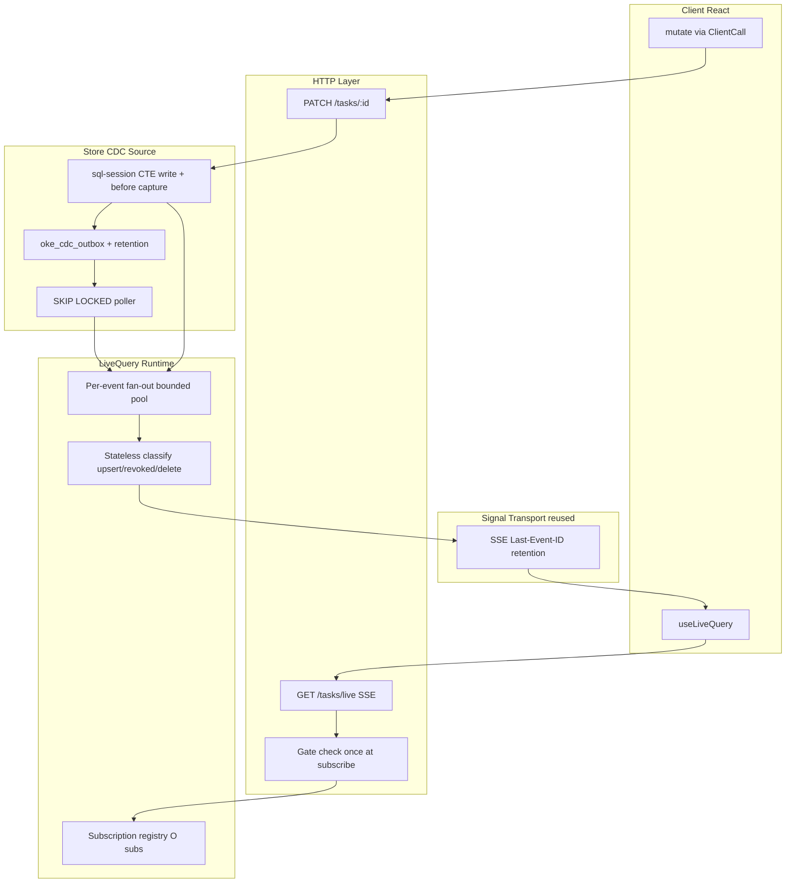
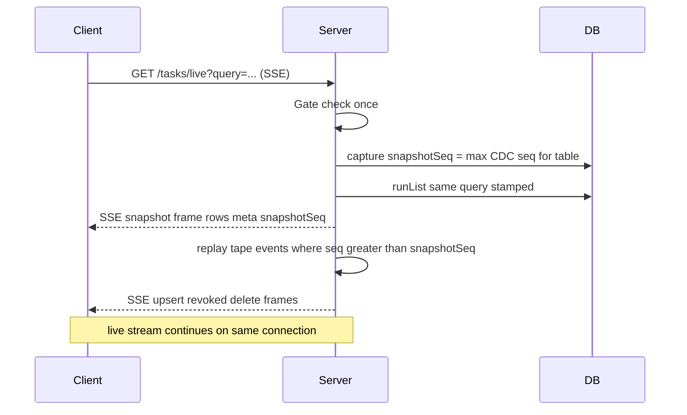
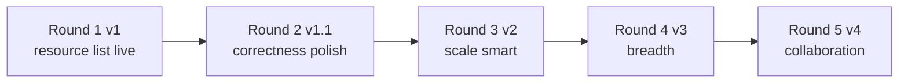

# Realtime Capability — Investigation & Architecture Design

> **Status:** Shipped (Phases 1–5). CDC write hook + outbox, LiveQueryRuntime, `store.resource({ live: true })` compiler synthesis, `useLiveQuery` + optimistic mutate, G16 fan-out bench, Keel inbox live route, docs/changelog.

---

## Approved as designed (no changes)

- CDC wiring tradeoff: application-level hook (v1) + `oke_cdc_outbox` SKIP LOCKED poller (prod); logical replication deferred
- RLS-reuse architectural bet: per-subscriber stamped re-check, not ZQL diffing
- Query-filter-exit taxonomy (`revoked` with `reason: "query" | "rls"`)
- Declaration on `store.resource({ live: true })` with compiler-synthesized signal + CDC + GET `/live`
- Optimistic-write via `mutate(flow, input, { optimistic })` wrapping existing `ClientCall` / Flow envelope
- `store.schema.policy.scope(PolicyGateDecl | string)` DRY fix
- Bounded fan-out worker pool as **architecture contract** (not optional optimization)
- Subscribe protocol: snapshot → replay → live (no list+SSE race)
- `live: true` author sugar → internal `live: { enabled: true }` config
- `revoked.reason` required on public wire protocol

---

## Hardening 1 — Classification without per-subscription row-set tracking

### The ambiguity

The classification algorithm references **"before visible under stamp"** and **"pk in local set"**. The latter must **not** imply server-side mirroring of each client's row set — that would be `O(subscribers × rows)` memory and is unacceptable at scale.

### Precise mechanism (confirmed: no row-set tracking)

**Server memory per live subscription is fixed-size only:**

| Field         | Purpose                                                     |
| ------------- | ----------------------------------------------------------- |
| `sessionId`   | SSE connection identity                                     |
| `resourceRef` | e.g. `sql:db`                                               |
| `queryHash`   | Canonical hash of list input (filters, sort, limit)         |
| `rlsIdentity` | `{ gate, userId, scopes, tenantId? }` — frozen at subscribe |
| `sseHandle`   | Transport cursor (`lastEventId`)                            |

**No set of row PKs, no "seen rows" bitmap, no server-side query result cache per subscriber.** Registry size is `O(active_subscriptions)` — same order as open SSE connections (G3b measured ~1.5 fds/subscriber).

### Stateless classification per CDC event

For each `{ before, after }` event and each subscription on the affected table:

```
pk = extractPk(before ?? after)

── DELETE (after === null) ──
  if beforeVisible(sub, before_payload):
    emit delete(pk)
  else:
    ignore

── INSERT / UPDATE (after !== null) ──
  if afterVisible(sub, live_heap):
    emit upsert(after)
  else if before !== null AND beforeVisible(sub, before_payload):
    emit revoked(pk, reason)   // reason = "rls" | "query" from which check failed
  else:
    ignore
```

**Two distinct visibility functions — both stateless, both RLS-authoritative:**

#### `afterVisible` — heap read (live row)

```sql
-- One stamped round-trip; RLS enforced by Postgres on current row:
SELECT 1 FROM "{table}" t
WHERE t."{pk}" = $1
  AND ({compiled_query_filters})
LIMIT 1
```

Uses the subscriber's stamped connection (`applyRlsStamp` → `SET LOCAL` GUCs → `oke_app` role). This is the primary check.

#### `beforeVisible` — payload eval (no heap read; row may be gone or mutated)

After an UPDATE, the heap holds the **after** image. A `SELECT` on the table cannot recover the **before** image. DELETE removes the row entirely. Therefore `beforeVisible` **never reads the table** — it evaluates the CDC `before` payload against the **same compiled policy expressions** already emitted to `CREATE POLICY` and query filters:

```sql
-- Stamped prelude (same GUCs), then:
SELECT oke.row_passes_policies(
  $table_oid_or_name,
  $before_jsonb,          -- CDC before payload
  $query_filter_jsonb     -- compiled list filters as evaluable expr
)
```

`oke.row_passes_policies` is a new `STABLE` helper (sibling to `oke.gate()`, `oke.user()`, `oke.tenant()`, `oke.has_scope()` in [`src/drivers/pg-rls.ts`](src/drivers/pg-rls.ts)). It replays manifest-compiled `USING` / `WITH CHECK` expressions against the jsonb row — **same SQL strings** as `CREATE POLICY`, not hand-rolled app logic. Compiler emits a companion function per table (or one generic with table-keyed policy map) at schema push time.

**Why this is not "tracking":** each event is classified from `(before_payload, after_payload, subscriber_identity, query_filters)` alone. No history, no membership set, no cross-event state.

#### Why `"pk in local set"` is removed from the server algorithm

That phrase was client-side shorthand. The server never needs to know what the client holds:

- If `beforeVisible` is true, the subscriber **could** have had the row (initial snapshot or prior upsert) → send `revoked`/`delete` so the client removes it.
- If `beforeVisible` is false, the subscriber **could not** have had the row under correct RLS + query semantics → `ignore` (no spurious removal).
- Optimistic client state is reconciled by the mutation response path; CDC events are authoritative for other writers.

**False removal is impossible** under this model: `revoked`/`delete` only fire when `beforeVisible` proves the row was in the subscriber's visibility envelope before the change.

---

## Hardening 2 — Fan-out latency ceiling (documented, not deferred)

### Cost model (from measured benchmarks)

Each subscriber × each event incurs one stamped visibility check (~G8a/G8c):

| Benchmark | Measurement                | Number                                    |
| --------- | -------------------------- | ----------------------------------------- |
| G8a       | Single stamped write p99   | **~1 ms**                                 |
| G8c N=50  | Concurrent stamped ops p50 | **40.6 ms** wall for 50 parallel          |
| G8c N=100 | Concurrent stamped ops p50 | **~70 ms** (interpolated from sweep)      |
| G8c N=200 | Concurrent stamped ops p50 | **96.6 ms** wall for 200 parallel         |
| G1 PGlite | Serialized stamp queue     | **~0.12–0.25 ms/op** amortized — dev only |

Fan-out latency for one CDC event to **S** subscribers (Postgres pool, parallel checks):

```
p50_fanout ≈ ceil(S / pool_concurrency) × stamp_p50
p99_fanout ≈ ceil(S / pool_concurrency) × stamp_p99
```

With default pool concurrency ~16–32 and stamp_p50 ≈ 0.5–1 ms (G8a), last-subscriber delivery time grows **linearly with S**.

### Subscriber-count ranges — when it stops feeling "instant"

Using **<50 ms p50** as "instant" (single visual update) and **<150 ms p50** as "snappy":

| Active subscribers (same table/query) | Estimated p50 fan-out | UX                                            |
| ------------------------------------- | --------------------- | --------------------------------------------- |
| **1–30**                              | 1–15 ms               | Instant                                       |
| **30–80**                             | 15–50 ms              | Instant to snappy                             |
| **80–150**                            | 50–100 ms             | Snappy; power users may notice on hot tables  |
| **150–300**                           | 100–200 ms            | **Perceptible lag** — updates arrive in waves |
| **300+**                              | 200 ms+ linear        | **Not instant** — capacity planning required  |

**PGlite dev:** serialized `withRlsStampLock` (G1) — treat fan-out as correctness-only; do not infer prod latency from PGlite.

**Document in site docs** (not internal note): live query fan-out is `O(subscribers)` per write per table. Tables with >150 concurrent live subscribers on the same resource should expect perceptible delay; >300 is a soft ceiling for "real-time feel" without architectural change.

**v2 identity dedup** (same `RlsIdentity` → one check, fan to N sessions) reduces work only when subscribers share identical bags — common in tenant dashboards, rare in per-user feeds. It is an optimization, not a fix for 500-subscriber firehoses.

### Architecture contract — bounded fan-out worker pool (v1, not optional)

`active_subscriptions × SQL checks per event` is the **largest operational risk** in this design. The v1 trade-off is intentional: **correctness bought with stamped SQL round-trips** (100 subscribers + 1 event ≈ 100 visibility checks). That is acceptable. What is **not** acceptable is unbounded accidental overload:

```
10,000 subscribers × 100 events/sec ≈ 1,000,000 authorization queries/sec
```

The bounded worker pool is therefore **part of the architecture contract from day one**, not a v2 optimization footnote.

| Contract rule               | v1 behavior                                                                                                                                           |
| --------------------------- | ----------------------------------------------------------------------------------------------------------------------------------------------------- |
| **Fan-out concurrency cap** | Fixed worker pool (default tied to SQL pool size, e.g. 32); never unbounded `Promise.all` per event                                                   |
| **Queue depth cap**         | Per-table or global max pending fan-out jobs; G15 backpressure pattern                                                                                |
| **Under overload**          | Delivery **delays** (events queue) — never OOM, never unbounded in-memory queue                                                                       |
| **Hard shed (optional v1)** | If queue exceeds cap, drop **oldest undelivered** fan-out batch for that table and increment `oke_live_fanout_shed_total` — document as degraded mode |
| **Metrics**                 | `oke_live_fanout_queue_depth`, `oke_live_fanout_checks_total`, `oke_live_fanout_duration_ms` — required in Phase 5                                    |
| **Doctor**                  | `live_subscriber_pressure` warn >150 subs; **error** if fan-out queue sustained above cap                                                             |

Implement in **Phase 2** as non-negotiable alongside the classifier — not Phase 5 polish.

---

## Hardening 3 — UPDATE before-image: single statement, not separate read

### Investigation result

**Confirmed:** an unconditional **separate application round-trip** (`findById` then `UPDATE`) is **not** required. The before-image can be captured in **one SQL statement** within the same stamped transaction.

PostgreSQL `UPDATE … RETURNING` returns only **new** tuples. Old values require a CTE snapshot in the same statement:

```sql
WITH old AS (
  SELECT * FROM "{table}" WHERE "{pk}" = $1
),
updated AS (
  UPDATE "{table}" t
  SET {set_clauses}
  FROM old
  WHERE t."{pk}" = old."{pk}"
  RETURNING t.*, to_jsonb(old) AS __oke_before
)
SELECT * FROM updated;
```

- **One round-trip** from `sql-session` (or `exec` within existing `withRlsStamp` transaction).
- **One heap read** of the old row (unavoidable at storage level — the DB must read the old tuple to update it).
- Eliminates the extra `findById` that [`store.resource` update](src/elements/store/resource.ts) uses today (~lines 939–947) when wired for CDC.

**INSERT:** `before = null`; `INSERT … RETURNING *` → `after` only.

**DELETE:** `WITH old AS (SELECT * FROM … WHERE …), deleted AS (DELETE … RETURNING *) SELECT old.*, deleted.*` — or `DELETE … RETURNING *` with `to_jsonb` from a CTE snapshot taken in the same statement.

**Batch UPDATE** (`update().set().where(condition)`): `WITH old AS (SELECT * FROM t WHERE {compiled_where}), updated AS (UPDATE … FROM old WHERE …) SELECT …` — one statement, multiple rows, CDC dispatches per row from result set.

**PGlite / Postgres:** same SQL; no driver-specific gap identified.

**Plan correction:** replace "one extra read per mutation" with **"one CTE snapshot inside the write statement; zero additional application round-trips."**

---

## Hardening 4 — `oke_cdc_outbox` retention / pruning

### Requirement

`oke_cdc_outbox` must not be the only durable table without retention discipline. Signal live tapes already prune via [`liveIdsToPrune`](src/drivers/signal-retention.ts) (`maxAge` + `maxCount`, AND-combined) on every `pruneLive` call in [`signal-postgres.ts`](src/drivers/signal-postgres.ts).

### Schema

```sql
CREATE TABLE oke_cdc_outbox (
  id          TEXT PRIMARY KEY,
  store       TEXT NOT NULL,
  table_name  TEXT NOT NULL,
  before_json TEXT,          -- nullable (INSERT)
  after_json  TEXT,          -- nullable (DELETE)
  column      TEXT,          -- optional column filter
  created_at  BIGINT NOT NULL,
  status      TEXT NOT NULL, -- 'pending' | 'dispatched' | 'dead'
  locked_by   TEXT,
  lease_expires_at BIGINT
);
CREATE INDEX oke_cdc_outbox_pending ON oke_cdc_outbox (status, created_at);
```

### Retention declaration

Mirror Signal's [`SignalRetention`](src/elements/signal/declare.ts) shape on store config:

```typescript
export const db = store.sql("db", {
  schema,
  cdc: {
    retention: { maxAge: "24h", maxCount: 50_000 }, // defaults if omitted
  },
});
```

| Field      | Default (if omitted) | Rationale                                                                   |
| ---------- | -------------------- | --------------------------------------------------------------------------- |
| `maxAge`   | `"24h"`              | Dispatched rows pruned after 24h; pending rows never pruned before dispatch |
| `maxCount` | `50_000`             | Cap total rows per store outbox (pending + dispatched)                      |

Reuse [`liveIdsToPrune`](src/drivers/signal-retention.ts) — same AND-combined semantics, same `parseDurationMs` for `maxAge`.

### Prune points (same rhythm as Signal)

1. **After each poller drain pass** — prune dispatched rows outside retention window.
2. **On poller startup** — prune before claiming.
3. **Never prune `status = 'pending'` or `status = 'inflight'`** (lease held) — only `dispatched` and `dead`.

### Dead rows

Failed dispatch after max retries → `status = 'dead'`; pruned by same retention (prevents dead-letter accumulation).

---

## Hardening 5 — Implementation gate: `oke.row_passes_policies()` RLS parity suite

### Why this is a hard gate (not a Phase 5 nice-to-have)

`oke.row_passes_policies()` is the **only genuinely novel piece** in this design. It replays manifest-compiled policy expressions against a **synthetic JSONB payload** instead of Postgres heap-scan RLS. Any divergence between replay and native RLS silently reintroduces the exact failure modes this project has fought hardest against:

- **Leaked revoked row** — replay says visible, Postgres says deny → stale row lingers in `useLiveQuery`
- **False revocation** — replay says deny, Postgres says visible → row wrongly removed

`afterVisible` (stamped heap `SELECT`) is ground-truth by construction. **`beforeVisible` depends entirely on this helper.** Implementation of Phases 2–5 is **blocked** until the parity suite below is green.

### Ground-truth protocol (per case)

For each `(identity, table, command, row_json)` tuple:

1. **Install** real `CREATE POLICY` DDL from manifest-emitted expressions (same path as production schema push via [`installOkeRlsHelpers`](src/drivers/pg-rls.ts) + table policies).
2. **Stamp** the subscriber identity (`applyRlsStamp` / `buildRlsIdentityPreludeSql`) on a real connection (PGlite minimum; live Postgres when `OKE_TEST_DOCKER=1`).
3. **Ground truth** — native Postgres RLS:
   - `SELECT`: `SELECT EXISTS (SELECT 1 FROM "{table}" t WHERE t."{pk}" = $pk)` through stamped connection **after** inserting/upserting the row via unstamped owner connection (or `INSERT … ON CONFLICT` as setup).
   - `INSERT` / `UPDATE` / `DELETE`: use command-appropriate ground truth — `INSERT` attempt with rollback, or `pg_catalog` policy inspection is **not** allowed; must be observable allow/deny identically to what a real `fx.store` write would hit (`WITH CHECK` for insert/update, `USING` for select/delete).
4. **Replay**: `SELECT oke.row_passes_policies($table, $row_jsonb, $command)` through the **same stamped connection** (same GUCs).
5. **Assert**: `replay === ground_truth` — exact boolean match, no "mostly right."

Adversarial cases must include **rows that almost pass** (wrong owner, wrong tenant, missing scope, empty scopes JSON, cross-tenant reassignment before-images).

### Policy families — minimum coverage (every family, not happy-path only)

| Family                     | Policy helper                                                                             | Ground-truth scenarios                                                                                                                                                                                                                                                           |
| -------------------------- | ----------------------------------------------------------------------------------------- | -------------------------------------------------------------------------------------------------------------------------------------------------------------------------------------------------------------------------------------------------------------------------------- |
| **owner**                  | `store.schema.policy.owner("owner", { for: "all" })`                                      | own row / other user's row / empty `oke.user()` / concurrent identities (pattern from [`sql-rls-isolation.test.ts`](src/elements/store/sql-rls-isolation.test.ts))                                                                                                               |
| **tenant**                 | `store.schema.policy.tenant("tenant_id")`                                                 | matching tenant / cross-tenant / `tenantId` omitted vs empty string / concurrent tenants (pattern from [`sql-rls-isolation.test.ts`](src/elements/store/sql-rls-isolation.test.ts) bookings + [`vault/sql-rls-isolation.test.ts`](src/elements/vault/sql-rls-isolation.test.ts)) |
| **gate**                   | `store.schema.policy.gate("member", { for: "select" })`                                   | `oke.gate() = 'member'` match / mismatch / public gate                                                                                                                                                                                                                           |
| **scope (string)**         | `store.schema.policy.scope("booking:create", { for: "insert" })`                          | scope present in `oke.scopes` JSON / absent / empty scopes GUC                                                                                                                                                                                                                   |
| **scope (PolicyGateDecl)** | `const g = gate.scope("booking:create"); store.schema.policy.scope(g, { for: "insert" })` | same cases as string form — proves DRY fix emits identical SQL                                                                                                                                                                                                                   |

### Multi-policy compositions — minimum two (mandatory)

These mirror **real combinations already proven** in this repo, not synthetic single-policy tables:

#### Composition A — `gate + owner` ("member + admin firehose" family)

Table with **two permissive policies** (same pattern as [`schema-decl.test.ts`](src/elements/store/schema-decl.test.ts) bookings table):

```typescript
[
  store.schema.policy.gate("member", { for: "select" }),
  store.schema.policy.owner("owner", { for: "all" }),
];
```

Test matrix: member+owner / member+not-owner / wrong-gate+owner / wrong-gate+not-owner. Ground truth must reflect **permissive OR** semantics (Postgres default): visible if **any** policy passes.

#### Composition B — `tenant + scope` ("tenant + scope" family)

Table with:

```typescript
[
  store.schema.policy.tenant("tenant_id", { for: "all" }),
  store.schema.policy.scope("booking:create", { for: "insert" }),
  store.schema.policy.gate("member", { for: "select" }),
];
```

Test matrix across commands (`select`, `insert`, `update`): correct tenant + scope / correct tenant + missing scope / wrong tenant + scope / before-image row from cross-tenant reassignment (the revoked-path adversarial case).

### Test file and CI placement

- **New file:** `src/elements/store/rls-row-passes-policies.parity.test.ts`
- **PGlite:** always runs in `bun test` (same as [`sql-rls-isolation.test.ts`](src/elements/store/sql-rls-isolation.test.ts))
- **Live Postgres:** `describe.skipIf(!LIVE_PG)` block — required before merge to `dev`, same env gate as existing RLS isolation tests
- **Not substitutable** by unit tests that mock policy SQL strings — must hit real `CREATE POLICY` + real `oke.*()` helpers

### Gate criterion

> **Phase 2 (LiveQuery runtime) must not begin until `rls-row-passes-policies.parity.test.ts` is green on PGlite and green on live Postgres when infra is available.**

Failure of any parity case is a **ship blocker** for the entire Realtime round, not a follow-up ticket.

---

## Architecture summary (unchanged core)



### Event taxonomy — public wire protocol (v1)

`reason` on `revoked` is **required in the public contract from day one** — not an internal debug field. UI may ignore it; operators and client reducers must not.

```typescript
type LiveQueryEvent =
  | { kind: "snapshot"; rows: Row[]; meta?: ClientListMeta; snapshotSeq: number }
  | { kind: "upsert"; row: Row; seq: number; rowVersion?: string | number }
  | { kind: "revoked"; id: string; reason: "rls" | "query"; seq: number }
  | { kind: "delete"; id: string; seq: number };
```

| `revoked.reason` | Meaning                                                                     |
| ---------------- | --------------------------------------------------------------------------- |
| `"rls"`          | Row exists; subscriber's stamped RLS check fails on current or before image |
| `"query"`        | RLS passes but row fails list query filters (e.g. status left the window)   |

TypeScript client types and site docs must include `reason` — never strip it in codegen or examples.

### Authorization

| Layer               | When             | Mechanism                                                                              |
| ------------------- | ---------------- | -------------------------------------------------------------------------------------- |
| Gate                | Subscribe once   | `on(http.get(...).gate(member).live(...))`                                             |
| RLS                 | Every event      | `afterVisible` heap check + `beforeVisible` payload eval via `oke.row_passes_policies` |
| Optional accelerant | Known revocation | Signal abort / forced SSE reconnect                                                    |

### Declaration

```typescript
const member = gate.scope("member");
const bookingCreate = gate.scope("booking:create");

export const tasks = store.schema.table("tasks", { ... }, [
  store.schema.policy.scope(bookingCreate, { for: "insert" }),
  store.schema.policy.tenant("tenant_id"),
]);

export const tasksR = store.resource(db, tasks, {
  in: TaskIn, out: TaskOut, list: { defaultLimit: 50 },
  live: true,   // user-facing sugar
});

export const tasksMount = on(http.resource("/tasks", tasksR.all()).gate(member));
// Compiler synthesizes: GET /tasks/live, internal CDC binding, @oke/live/sql:db:tasks signal
```

### `live` declaration — boolean today, config object internally

**User-facing API (v1):** `live: true` only — keep DX minimal.

**Compiler/runtime normalization (from day one):** every `live: true` becomes an internal config object so later rounds add fields without breaking the public API:

```typescript
// Author writes:
live: true

// Compiler normalizes to manifest/runtime:
live: {
  enabled: true,
  // v1 defaults only — not exposed to author yet:
  // replay: true,
  // heartbeatMs: 30_000,
  // maxSubscribers: undefined,
}
```

**Future (Rounds 2–3, not v1 author API):** same object gains `replay`, `heartbeat`, `maxSubscribers` without changing `live: true` sugar. Runtime reads `ResourceLiveConfig` from manifest — never a bare boolean in kernel code.

---

### Client API (refined — resource shortcuts + query-window live)

**Not the first draft.** The generic `mutate(flow, input, { optimistic })` every call is correct but verbose for the 90% CRUD case. Locked refinement:

#### `useLiveQuery` return shape

```typescript
const live = useLiveQuery(
  api.tasks.list,
  { status: "open", limit: 20 },
  {
    enabled: session.status === "authenticated", // default true; skip SSE when false
    autoResubscribe: true, // default true; SSE backoff on disconnect
  },
);

live.data; // Row[] | null — populated from SSE snapshot frame, then live events
live.meta; // same list meta from snapshot frame
live.error;
live.isLoading; // waiting for first snapshot frame (not parallel HTTP list)
live.isReconnecting; // SSE reconnect in flight (distinct from loading)
live.isConnected;

await live.refetch(); // manual HTTP list() refresh; does not replace subscribe protocol on reconnect

// Resource shortcuts — compiler stamps sibling CRUD paths when live: true
await live.patch({ id, status: "done" });
await live.create({ title, body });
await live.remove(id);

await live.mutate(
  api.tasks.archive,
  { id },
  {
    optimistic: (rows) => rows.filter((r) => r.id !== id),
  },
);
```

**`enabled`:** when `false`, no SSE — hook stays idle. Re-subscribes when `enabled` flips true.

**Identity refresh (v1):** `auth.refresh()` success → all active `useLiveQuery` instances reconnect via subscribe protocol (new snapshot + replay).

**Default optimistic merge (opt-out via `mutate` override):**

| Shortcut        | Flow              | Optimistic behavior                                          |
| --------------- | ----------------- | ------------------------------------------------------------ |
| `patch(input)`  | resource `update` | merge by PK: `{ ...row, ...patchFields }`                    |
| `create(input)` | resource `create` | append placeholder row; replace on confirm / remove on error |
| `remove(id)`    | resource `remove` | remove by PK immediately; restore snapshot on error          |

Compiler requirement: when `live: true`, stamp `$routes` metadata linking `list` → `update` / `create` / `remove` / `live` paths so the client can resolve shortcuts without runtime codegen. Typed via existing `ClientCall` inference from adopt.

**Compiler guardrails (fail loud at `extract` / adopt):**

| Check                                             | Severity  | Message intent                                                       |
| ------------------------------------------------- | --------- | -------------------------------------------------------------------- |
| Table has no PK column                            | **error** | `live: true` requires a primary key for upsert/revoked/delete        |
| Table has no `updatedAt` / `updated_at` timestamp | **warn**  | Live optimistic races rely on `mutationId`; `rowVersion` unavailable |
| `live: true` on table without RLS policies        | **warn**  | Live without RLS is operator-bypass territory — confirm intent       |
| Tenancy on + table missing tenant policy          | **error** | existing `assertTenantSafeSchema` — unchanged                        |

Auto-detect `rowVersion` source: compiler picks first `field.timestamp()` column named `updatedAt` or `updated_at`; stamp in manifest for runtime envelope.

**`useLive` vs `useLiveQuery`:** keep both — different jobs. `useLive` = event log (`events[]`, `latest`). `useLiveQuery` = row-set reducer. Docs must state this on day one.

#### Pagination — query-window live (best v1 model)

Live does **not** try to be a magical full-table mirror across pages. It subscribes to the **exact list input bag** — filters, sort, limit, **and cursor** — i.e. the window the user is viewing.

```typescript
const [cursor, setCursor] = useState<string | undefined>();
const live = useLiveQuery(api.tasks.list, { status: "open", limit: 20, cursor });

// User clicks next page:
setCursor(live.meta?.next?.cursor);
// → hook tears down SSE, runs full subscribe protocol with new cursor (new snapshot + replay)
```

| Pattern                                | v1 behavior                                                                               |
| -------------------------------------- | ----------------------------------------------------------------------------------------- |
| **Unpaged / dashboard list**           | `{ status: "open", limit: 50 }` — live maintains that full window                         |
| **Paged table (one page visible)**     | include `cursor` in input — live reconciles **this page only**                            |
| **Cursor changes**                     | full reset (new fetch + new subscription) — correct, not incremental                      |
| **Infinite scroll / multi-page merge** | **not v1** — would need `useLiveInfiniteQuery`; defer; use unpaged limit or per-page live |
| **`for await` page walk**              | not a live UI pattern — export/batch only                                                 |

This matches the server model: `queryHash` in the subscription registry is the list input canonicalized (including cursor). No ZQL diff; no cross-page event routing. Honest and implementable.

**Server stays one line:** `store.resource(db, tasks, { live: true })` + existing `http.resource` mount — no extra `on(http.get(...).live())` for the developer.

### Tenancy

No parallel logic. `rlsIdentity` bag includes `tenantId` when `manifest.tenancy.enabled`; `oke.tenant()` in policies and `afterVisible` / `beforeVisible` both respect it. Cross-tenant reassignment → `revoked`.

---

## What v1 delivers (scope statement)

v1 is **correct live CRUD for `store.resource` list windows** — not full-platform Realtime. It completes when:

- A developer sets `live: true` on a resource, mounts it, and uses `useLiveQuery` + `patch`/`create`/`remove`
- Rows update in real time with correct `upsert` / `revoked` / `delete` semantics (including `revoked.reason`)
- Initial data via SSE **snapshot frame** — subscribe protocol eliminates list/SSE race
- Writes through `fx.store` propagate via CDC; multi-host works via outbox
- Fan-out bounded under load (no unbounded auth-query storm)

v1 does **not** claim: infinite scroll, external DB writers, KV/files live, presence, joins, or sub-50ms fan-out above ~150 subscribers.

---

## v1 correctness contracts (required — not deferred)

These close production gaps that architecture alone does not solve. All are **in scope for the v1 round** (Phases 2–4).

### Event envelope — version + ordering

Every live event carries a monotonic **`seq`** (per-table CDC stream) and optional **`rowVersion`** (from `updatedAt` column when present on table, else omitted):

```typescript
// See "Event taxonomy — public wire protocol" for full type including snapshot + required revoked.reason
```

**Server:** `seq` assigned at CDC dispatch (outbox row id or monotonic counter per table). **Client reducer rules:**

1. Ignore event if `seq <= lastAppliedSeq` for this subscription (idempotent replay after SSE reconnect).
2. For `upsert` on same PK: apply only if `rowVersion` is absent **or** `rowVersion >= localRow.rowVersion` (last-write-wins by server timestamp).
3. Per-PK events may arrive out of order over SSE; version check prevents stale overwrites.

### Optimistic write vs CDC race

When the **same client** mutates and receives both HTTP response and SSE event:

| Order               | Behavior                                                                        |
| ------------------- | ------------------------------------------------------------------------------- |
| Response before SSE | Apply optimistic patch; SSE `upsert` reconciles (version check dedupes)         |
| SSE before response | Apply SSE; response `data` overwrites if same or newer `rowVersion`             |
| Response error      | Rollback optimistic snapshot; ignore matching SSE `upsert` for that mutation id |

**Required `mutationId` (v1):** every `patch` / `create` / `remove` / `mutate` generates a client UUID; sent as `X-Oke-Mutation-Id` header; server echoes in CDC event metadata. Client holds a pending set — ignores SSE `upsert` for matching `mutationId` until HTTP response settles. Works even when table has no `updatedAt`. **`rowVersion` is additive** when compiler detects `updatedAt`/`updated_at` (guardrails above); both checks apply.

### SSE 410 resume gap

On `LiveResumeGap` (OKE1014): client **must** full resubscribe via **subscribe protocol** (new `snapshot` frame + replay) — not replay partial tape alone. Same gap class as [`live.ts`](src/client/live.ts); live query resets row set from new snapshot.

### Subscribe protocol — snapshot + SSE (fixes list/SSE race)

**Problem:** parallel `GET list` + `open SSE` races in both directions:

| Order                        | Failure                                             |
| ---------------------------- | --------------------------------------------------- |
| list → change → SSE connects | Missed event between list response and subscription |
| SSE → event → list           | Duplicate or out-of-order merge on client           |

Reconnect / `Last-Event-ID` / 410 gap recovery are necessary but **not sufficient** without a defined subscribe sequence.

**Locked v1 protocol — server-owned ordering via single SSE connection:**



**Steps (normative):**

1. **Subscribe** — client opens SSE only (`GET …/live` with query params). **No parallel initial `list()`** for first paint.
2. **Establish position** — server captures `snapshotSeq` (monotonic CDC seq for table) **before** running snapshot query.
3. **Initial snapshot** — server runs same `runList` as list flow; sends `{ kind: "snapshot", rows, meta, snapshotSeq }` as **first SSE frame**.
4. **Replay** — server delivers classified events from live tape where `seq > snapshotSeq` (per-subscriber visibility at fan-out).
5. **Live stream** — new CDC events append on same SSE connection.

**Client (`useLiveQuery`):** populate `data` from `snapshot` frame; apply subsequent events. `refetch()` may call HTTP `list()` for manual refresh; **subscribe/reconnect always uses protocol above**.

**Signal tape:** per-subscription events use Signal `delivery: "live"` retention physics; replay uses seq cursor, not a second transport.

### Tier-1 cache interaction

Live fan-out path does **not** bypass [`store/cache.ts`](src/elements/store/cache.ts). CDC-triggered visibility checks use stamped SQL (cache miss path). Document: live subscriptions do not read tier-1 cache for per-event checks; list initial snapshot may hit cache per existing resource list behavior.

### Live session retention

Per-subscription SSE tape uses same `SignalRetention` shape as live signals — default `{ maxCount: 1_000, maxAge: "1h" }` on synthesized live signal; compiler applies when `live: true`.

---

## Operations & observability (v1 — Phase 5)

Production Realtime requires ops surface, not only feature code.

### Metrics (exported for Console / Prometheus-style scraping)

| Metric                           | Type      | Purpose                                      |
| -------------------------------- | --------- | -------------------------------------------- |
| `oke_live_subscribers`           | gauge     | Active subscriptions by `store.table`        |
| `oke_live_fanout_duration_ms`    | histogram | Per-event fan-out wall time                  |
| `oke_live_fanout_checks_total`   | counter   | Stamped visibility checks executed           |
| `oke_live_fanout_queue_depth`    | gauge     | Pending fan-out jobs (architecture contract) |
| `oke_live_fanout_shed_total`     | counter   | Events shed under queue cap (degraded mode)  |
| `oke_cdc_outbox_pending`         | gauge     | Undispatched outbox rows                     |
| `oke_cdc_outbox_dispatch_errors` | counter   | Dead-letter dispatches                       |

### `oke doctor` checks (new findings)

- `cdc_outbox_backlog` — warn if pending > 10k; error if > 100k
- `cdc_outbox_retention` — warn if dispatched rows exceed `maxCount` (pruner stuck)
- `live_subscriber_pressure` — warn if any table > 150 active subs (references Hardening 2 doc)
- `live_fanout_queue_saturated` — error if fan-out queue sustained above cap

### Console (ui-next)

- Store band: **Live** strip on resources with `live: true` — active subscriber count, last fan-out p50 (from metrics)
- Manifest inspector: show synthesized `GET …/live` route + internal CDC binding

---

## Implementation phases

### Phase 1 — CDC source + RLS parity gate

- `oke.row_passes_policies` helper (schema push) — **implement first**
- **`rls-row-passes-policies.parity.test.ts` — BLOCKING GATE** (Hardening 5); must be green before Phase 2
- CTE write hook in [`sql-session.ts`](src/elements/store/sql-session.ts) (single-statement before capture)
- `oke_cdc_outbox` + retention + SKIP LOCKED poller
- Wire `dispatchCdc` for user-declared CDC flows

### Phase 2 — LiveQuery runtime (blocked until parity gate green)

- Fixed-size subscription registry (no row-set tracking)
- Stateless fan-out classifier (`afterVisible` + `beforeVisible`)
- **Bounded fan-out worker pool — architecture contract** (concurrency cap, queue cap, metrics, G15 backpressure)
- **Subscribe protocol:** snapshot frame → replay after `snapshotSeq` → live stream (single SSE)
- SSE via existing Signal transport + per-session retention
- Event envelope: `seq` + optional `rowVersion`; `revoked.reason` required on wire
- Default live session retention on synthesized signal

### Phase 3 — Compiler

- `store.resource({ live: true })` → normalize to `live: { enabled: true }` in manifest
- `$routes` CRUD sibling links for client shortcuts (`list` → `update` / `create` / `remove` / `live`)
- `store.sql({ cdc: { retention } })` manifest extraction
- `store.schema.policy.scope(PolicyGateDecl | string)`
- Compiler error: `live: true` on resource with unsupported list mode (document: cursor ok, no multi-table)
- Compiler guardrails: PK required, `updatedAt` warn, RLS warn (DX Pack A)

### Phase 4 — Client

- `useLiveQuery` row-set reducer (`snapshot` / `upsert` / `revoked` / `delete`)
- Initial data from SSE `snapshot` frame — no parallel list+SSE race
- Idempotent merge: `seq` dedup + `rowVersion` last-write-wins
- Optimistic race rules (response vs SSE); **required `mutationId`** on all writes
- Identity refresh: reconnect all live subs on `auth.refresh()` success
- Resource shortcuts: `patch` / `create` / `remove` with default id-keyed optimistic merge
- `mutate()` escape hatch for custom flows
- Query-window live: input change (incl. cursor) → reconnect
- `enabled` / `refetch()` options
- `isReconnecting` distinct from `isLoading`
- 410 gap → full list refetch then resubscribe

### Phase 5 — Ship

- Bench group G16: fan-out latency vs subscriber count (validate Hardening 2 table)
- Metrics + doctor checks (operations section)
- Console Live strip (minimal)
- Keel live tasks example
- Docs: fan-out ceiling, retention defaults, classification guarantees, parity gate, v1 scope vs roadmap

---

## Post-v1 roadmap (planned rounds — not v1 scope)

Full & smart Realtime is a **multi-round program**. v1 is Round 1. Subsequent rounds are ordered by dependency and user impact.



### Round 2 — v1.1 Correctness polish

| Item                        | Why                                                                                         |
| --------------------------- | ------------------------------------------------------------------------------------------- |
| **Live `get` (single row)** | `useLiveQuery(api.tasks.get, { id })` — one row, same CDC path                              |
| **Custom list flows**       | `flow({ live: true })` on hand-written list flows (Keel pattern), not only `store.resource` |
| **Batch write CDC**         | Multi-row CTE updates: fan-out coalescing per PK within same transaction                    |
| **Non-React client helper** | `createLiveQueryReducer()` in `okengine/client` for vanilla JS / other frameworks           |

### Round 3 — v2 Scale (smart at high subscriber count)

| Item                           | Why                                                                                        |
| ------------------------------ | ------------------------------------------------------------------------------------------ |
| **Identity-bag fan-out dedup** | One stamped check per unique `rlsIdentity`, fan to N SSE sessions                          |
| **CDC tenant pre-filter**      | When table has `tenant_id`, skip subs whose stamp tenant ≠ payload tenant before SQL check |
| **Column-scoped live**         | `live: { columns: ["status"] }` — ignore CDC when changed columns don't intersect          |
| **Per-PK event coalescing**    | Debounce N events same PK within 50ms window → one `upsert`                                |
| **Adaptive fan-out pool**      | Scale workers from backlog depth; client `isDegraded` when fan-out p99 > threshold         |
| **G16 sustained bench**        | Continuous 5min fan-out under load; regression gate in CI optional                         |

### Round 4 — v3 Breadth (full platform coverage)

| Item                       | Why                                                                                          |
| -------------------------- | -------------------------------------------------------------------------------------------- |
| **`useLiveInfiniteQuery`** | Infinite scroll with per-window live + merge strategy                                        |
| **External write path**    | Postgres logical replication subscriber **or** periodic reconcile job for non-OKE writers    |
| **KV / files live**        | Namespace-scoped change notifications (different physics than SQL RLS)                       |
| **Joins / relation live**  | Live query on parent invalidates/refetches children (explicit `with` relations in live decl) |
| **Aggregate live**         | `useLiveCount(query)` — count-only subscription without full row fan-out                     |
| **Index-backed lists**     | CDC → Meilisearch index invalidation bridge (not SQL live query)                             |
| **User CDC → live bridge** | `on(db.table().changed(), …)` can optionally feed live signal for automation flows           |

### Round 5 — v4 Collaboration (separate physics)

Not live query — uses Signal `broadcast` / `live` delivery. Documented separately to avoid polluting Store live.

| Item                             | Why                                                             |
| -------------------------------- | --------------------------------------------------------------- |
| **Presence**                     | `signal("presence", { delivery: "broadcast" })` + `usePresence` |
| **Typing / activity indicators** | Ephemeral broadcast, no CDC                                     |
| **Field-level locks**            | Explicitly out unless product demands — not CRDT                |

---

## Coverage matrix (honest status)

| Capability                           | v1  | v1.1 | v2  | v3  | Never |
| ------------------------------------ | :-: | :--: | :-: | :-: | :---: |
| Resource list live + optimistic CRUD |  ✓  |      |     |     |       |
| RLS revoked vs delete semantics      |  ✓  |      |     |     |       |
| Subscribe protocol snapshot+replay   |  ✓  |      |     |     |       |
| Bounded fan-out pool contract        |  ✓  |      |     |     |       |
| `live: { enabled }` internal config  |  ✓  |      |     |     |       |
| `revoked.reason` on wire             |  ✓  |      |     |     |       |
| Multi-host CDC outbox                |  ✓  |      |     |     |       |
| Event seq + version dedup            |  ✓  |      |     |     |       |
| Required mutationId on writes        |  ✓  |      |     |     |       |
| Identity refresh on auth             |  ✓  |      |     |     |       |
| Metrics + doctor                     |  ✓  |      |     |     |       |
| Live single-row get                  |     |  ✓   |     |     |       |
| Custom list flows                    |     |  ✓   |     |     |       |
| Fan-out identity dedup               |     |      |  ✓  |     |       |
| Coalescing + column filter           |     |      |  ✓  |     |       |
| Infinite scroll live                 |     |      |     |  ✓  |       |
| External DB writers                  |     |      |     |  ✓  |       |
| KV/files live                        |     |      |     |  ✓  |       |
| CRDT / offline-first                 |     |      |     |     |   ✗   |
| ZQL query diff                       |     |      |     |     |   ✗   |
| Per-message Gate re-check            |     |      |     |     |   ✗   |
| Server row-set tracking              |     |      |     |     |   ✗   |

---

## Explicit non-goals (locked — all rounds)

- CRDT / offline-first sync
- Postgres logical replication as v1 CDC
- Per-message Gate re-check
- ZQL-class query diffing
- Auto-derive all RLS from Gate
- Read-only live query round
- Server-side per-subscription row-set mirroring
