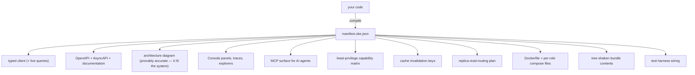

# okengine

*"Encore's batteries and dashboard, Elysia's speed and DX, Hono's portability — without the Rust lock-in, the cloud gravity, or the source-available license."*

[](https://www.npmjs.com/package/okengine)
[](https://jsr.io/@omqkhafi/okengine)
[](https://opensource.org/licenses/MIT)
[](https://bun.sh)

**Package:** `okengine` · **CLI:** `oke` · **Scaffold:** `create-oke` · **License:** MIT

### Install

```bash
bun add okengine                 # npm registry (recommended — ships the `oke` CLI)
bunx jsr add @omqkhafi/okengine  # JSR — library API only
bunx create-oke@latest my-app    # scaffold (npm)
```

### npm vs JSR

| Surface | npm | JSR (`@omqkhafi/…`) |
|---|---|---|
| Library imports (`okengine`, `/client`, `/drivers`, …) | yes | yes |
| Deep drivers (`okengine/drivers/postgres`, …) | yes | no — use the `/drivers` index, or install from npm |
| `oke` CLI | yes | no |
| `create-oke` scaffold | yes (`create-oke`) | library only (`@omqkhafi/create-oke`) |

JSR cannot rewrite the CLI’s dynamic imports of your app entry (`oke dev` / `oke start` / config load). Install `okengine` from npm when you need the binary. Deep driver subpaths use npm `exports` wildcards, which JSR does not support — import named drivers from `okengine/drivers` on either registry, or pin a deep path from the npm package.

---

## Start here

Most backends are a pile of separate tools under one logo: a router, a queue library, a cron library, websockets, tracing. The pieces ship together; they do not follow from one idea. That is why docs sprawl and concepts never get removed.

OKE starts from one sentence instead:

> **Every backend behavior is a Flow:** `on(Trigger) → Effects`

An HTTP route, a cron job, a queue consumer, a CDC hook — same shape. Triggers are typed values. Side effects go through `fx` (the only door to the outside world), so the compiler can see them.

Eight elements cover what a backend needs. Ten exports are the whole public vocabulary. Everything else is derived.

```typescript
import { on, flow, signal, store, clock, gate, vault, channel, ai, plugin } from "okengine";
```

Batteries included for the Bun era: contract-first APIs, typed client, infrastructure primitives, Console, auth — pure TypeScript, MIT, self-hostable, no cloud lock-in. Detail and comparisons live in [`docs/spec/unified-theory.md`](docs/spec/unified-theory.md).

---

## Run something in two minutes

```bash
bunx create-oke@latest my-app
cd my-app
oke dev
```

| Port | What |
|---|---|
| `:6530` | your app |
| `:6533` | Console |
| `:6535` | MCP |

That scaffolds the **Notes** app (same tree as [`examples/notes`](examples/notes)). Open the Console — flows, contracts, effects, and an architecture diagram are already there. Derived, not configured.

### The idea, in one file

A flow is a trigger, contracts, and a `do` that only talks to the world through `fx`:

### `examples/notes/src/flows/notes/index.ts`

```typescript
import { on, flow, http } from "okengine";
import { createInsertSchema, createSelectSchema } from "drizzle-zod";
import { z } from "zod";
import { db } from "../../core";
import { notes } from "../../schema";

// Contracts derived from the schema — one source of truth, refined where the API is stricter
const NewNote  = createInsertSchema(notes, { title: (s) => s.min(1).max(120) })
                   .omit({ id: true, createdAt: true });
const Note     = createSelectSchema(notes);
const NoteId   = z.object({ id: z.string() });
const NotFound = z.object({});

export const create = on(http.post("/notes"), flow({
  in: NewNote,
  out: NoteId,
  do: async (input, fx) => {
    const [note] = await fx.store(db).insert(notes).values(input).returning();
    return { id: note.id };
  },
}));
// effects → writes[sql:notes]

export const list = on(http.get("/notes"), flow({
  out: Note.array(),
  do: (_, fx) => fx.store(db).select().from(notes),
}));
// effects → reads[sql:notes]

export const get = on(http.get("/notes/:id"), flow({
  in: NoteId,
  out: Note,
  errors: { NotFound },
  do: async ({ id }, fx) => (await fx.store(db).findById(notes, id)) ?? fx.fail("NotFound", {}),
}));

export const remove = on(http.delete("/notes/:id"), flow({
  in: NoteId,
  errors: { NotFound },
  do: async ({ id }, fx) => {
    const deleted = await fx.store(db).delete(notes, id);
    if (!deleted) return fx.fail("NotFound", {});
  },
}));
```

Wire the unit into the app. The client needs only this type — no separate codegen:

### `examples/notes/src/app.ts`

```typescript
import { oke } from "okengine";
import * as notes from "./flows/notes";

export const app = oke({ name: "notes" }).adopt({ notes });

export type App = typeof app;   // ← the client needs nothing else
```

The rest of the scaffold is small and ordinary: `oke.config.ts` (drivers by protocol), `src/schema.ts` (Drizzle table), `src/core.ts` (`store.sql`). Full walkthrough: [`docs/spec/four-applications.md`](docs/spec/four-applications.md) · §1 Notes.

---

## How to learn (read in order)

Each app adds the smallest next set of ideas. Do not skip ahead.

1. **Notes** — `oke`, `on`, `flow`, `http`, `store.sql`, `fx`, typed errors, typed client  
   → [`examples/notes`](examples/notes)

2. **Linkly** — `signal` (three delivery physics), `clock`, `gate`, triggers beyond HTTP, transactional emit  
   → [`examples/linkly`](examples/linkly)

3. **Provisions** — durable flows, `vault`, `channel`, live queries, plugins, CDC, cache tiers  
   → [`examples/provisions`](examples/provisions)

4. **Skyport** — `ai`, multi-tenancy, SLOs, distributed topology, scaling axes  
   → [`examples/skyport`](examples/skyport)

Spec that teaches the same path: [`docs/spec/four-applications.md`](docs/spec/four-applications.md).

---

## The eight elements

An element earns its place only if it has irreducible physics. New tech becomes a **driver**, never a ninth element.

| Element | Essence | Replaces |
|---|---|---|
| **Flow** | behavior | endpoint, handler, consumer, job, workflow |
| **Signal** | data in motion | queue, pub/sub, stream, websocket, SSE |
| **Store** | data at rest | DB, cache, KV, files, search (`sql` · `kv` · `files` · `index`) |
| **Clock** | time | cron, delay, timeout, durable sleep, TTL |
| **Gate** | permission to act | auth, session, ABAC, rate limit, quota, flags |
| **Vault** | protected knowledge | secrets, config, env |
| **Channel** | reaching humans | email, SMS, WhatsApp, push |
| **AI** | reaching machine intelligence | models, prompts, embeddings, agents, RAG |

---

## What the Manifest is for

Your TypeScript compiles to `manifest.oke.json`. From that one artifact the rest is derived — client, docs, Console, security matrix, Docker, bundle, tests ([unified theory §8](docs/spec/unified-theory.md#8-the-manifest--the-100-year-artifact)):



---

## Console

Seventeen panels on `:6533` (app `:6530`, MCP `:6535`): Overview, Flows, Signals, Store, Clock, Gates, Vault, Channels, AI, Architecture, Traces, Runs, Manifest Diff, Access, Plugins — plus Privacy and Tenancy when those plugins are plugged.

Operator and user planes stay separate. Every Console action is a real flow through `fx`, so the audit log is the trace. → [`docs/spec/console.md`](docs/spec/console.md)

---

## How to deploy

OKE is self-host first — no cloud lock-in. Production artefacts are **derived from the Manifest**, not hand-written: Dockerfile, per-role compose files, and the same entry production actually runs ([unified theory §8](docs/spec/unified-theory.md#8-the-manifest--the-100-year-artifact), [§18](docs/spec/unified-theory.md#18-three-scaling-axes-never-conflated)).

1. **Configure drivers and images** in `oke.config.ts` — drivers named after protocols; vendor images keyed by role (e.g. `store.sql`, `store.kv`).
2. **Check the machine** before you ship:

```bash
oke doctor                       # secrets, ports, drivers, tenancy, schema drift
oke doctor --json                # -j  agents / CI: JSON on stdout, hints on stderr
oke stack                        # preview resolved images/tags/ports — writes nothing
oke images list                  # recipe · image · tag · digest · size (writes nothing)
```

3. **Derive Docker / compose**, then pin digests so tags cannot drift:

```bash
oke docker                       # Dockerfile + compose.store.sql.yml · compose.store.kv.yml · …
oke docker --prod                # -p  healthchecks, volumes, limits, secret refs, deploy.replicas
oke images pin                   # tags → digests in oke.images.lock
```

4. **Run what production runs.** `oke start` is the Docker `CMD` — the same process locally and in the container:

```bash
oke start                        # app on :6530 (Console :6533 stays on in prod, behind auth)
```

Horizontal scale is the **Clone** axis: run N instances; `oke docker --prod` emits `deploy.replicas`. Split into one container per unit is the **topology** axis — code unchanged (`monolith` vs `services`). For a tiny edge bundle: `oke build --target edge` (`-t`; < 15 kB kernel profile).

There is no separate “deploy to our cloud” product. You take the derived Dockerfile/compose and run them on whatever host you choose.

---

## CLI

Everyday:

```bash
bun add okengine                 # ONE package

oke dev                          # watch · hot reload · Console :6533 · app :6530 · MCP :6535
                                 #   → also auto-syncs client types on every save
oke dev --stack                  # -s  also boot the real infra stack (generated compose)
oke dev -s store.sql,signal      #     partial: only these roles get real backends

oke start                        # runs exactly what production runs (this is the Docker CMD)
oke doctor                       # verify secrets, ports, drivers, tenancy, schema drift
oke doctor --diff                # -d  CI gate: undeclared Manifest contract breaks
oke doctor --json                # -j  JSON on stdout; hints on stderr (agents / MCP)
oke stack                        # preview resolved images/tags/ports — writes nothing
oke stack --json                 # -j
```

Schema, vault, client, Docker, build, eval, branch, privacy, upgrade:

```bash
oke schema generate              # core + plugin tables → schema/oke.ts   (--check|-c in CI)
oke vault set STRIPE_KEY         # also: list · import .env · key rotate
oke client add <url>             # types for a separate frontend repo

oke docker                       # Dockerfile + compose.store.sql.yml · compose.store.kv.yml · …
oke docker --prod                # -p  healthchecks, volumes, limits, secret refs, deploy.replicas
oke images list                  # recipe · image · tag · digest · size (--json|-j)
oke images pin                   # tags → digests in oke.images.lock

oke build --target edge          # -t  < 15 kB kernel profile
oke eval                         # run prompt eval sets; fails CI on regression
oke branch prod --at "yesterday" # -a  fork journaled state into a sandbox
oke privacy erase --subject <id> # -s  crypto-shredding: deletes the key, not the terabytes
oke upgrade                      # dry-run codemods + diff; --apply|-a to write
oke gates list                   # Module:Action catalogue (--json|-j)
```

Shell completion (generated from the command registry — not a hand-maintained script):

```bash
eval "$(oke completion bash)"
eval "$(oke completion zsh)"
oke completion fish | source
```

Long form is canonical in docs; short form is convenience only. Shared letters follow git’s pattern (different meanings on different subcommands — e.g. `-c` is `--check` on `schema generate`, `--config` on `stack` / `docker` / `images`).

| Long | Short | Where |
|------|-------|--------|
| `--stack` | `-s` | `dev` |
| `--prod` | `-p` | `docker` |
| `--port` | `-p` | `start` |
| `--check` | `-c` | `schema generate` |
| `--config` | `-c` | `stack`, `docker`, `images` |
| `--apply` | `-a` | `upgrade` |
| `--at` | `-a` | `branch` |
| `--after` | `-a` | `doctor --diff` |
| `--target` | `-t` | `build` |
| `--diff` | `-d` | `doctor` |
| `--json` | `-j` | `doctor`, `stack`, `images list`, `gates list` |
| `--manifest` | `-m` | most Manifest readers |
| `--entry` | `-e` | `dev`, `start`, `build` |
| `--out` / `--outdir` | `-o` | writers |
| `--subject` | `-s` | `privacy erase` |
| `--before` | `-b` | `doctor --diff` |
| `--base` | `-B` | `doctor --diff` |

| Exit | Meaning |
|------|---------|
| **0** | success |
| **1** | usage / validation |
| **2** | runtime / environment / check failure |

`oke help` prints the same flag and exit-code tables.

---

## Plugins and security

`.plug()` attaches a plugin. Scope is the attachment point: `app.plug()` app-wide, `unit.plug()` one unit, `flow.plug()` one flow. No `global: true`, no inheritance rule — [unified theory §14](docs/spec/unified-theory.md#14-plugins--the-extensibility-law).

The Console is treated as internet-facing even on localhost. Host header validation, Origin validation, and authentication are mandatory on `:6530`, `:6533`, and `:6535` ([console.md §10](docs/spec/console.md#10-security-posture)): two-plane auth (operator vs user), capability-scoped tokens.

---

## Why Bun, one package, MIT

**Bun-first** — toolchain stays on latest (TypeScript 7, Bun, oxc): greenfield, speed is part of the promise. User floor stays conservative; adopted infra pins stable digests ([§11](docs/spec/unified-theory.md#11-always-latest--in-three-tiers)).

**One package** — `okengine` with subpath exports, not a monorepo of many packages to assemble. Small enough to be *finished* ([§27](docs/spec/unified-theory.md#27-package-structure-one-published-package), [§29](docs/spec/unified-theory.md#29-why-this-survives-a-hundred-years)).

**MIT** — no BSL/SSPL; self-host first; drivers as the community surface. Adopt what exists; bind through Bun’s native clients ([§9](docs/spec/unified-theory.md#9-adopt-dont-reinvent--but-bind-natively), [§16](docs/spec/unified-theory.md#16-the-default-table), [§29](docs/spec/unified-theory.md#29-why-this-survives-a-hundred-years)).

---

## Status

Pre-1.0. MIT. No `CONTRIBUTING` yet — issues and PRs welcome.

| Spec | Path |
|---|---|
| Unified theory | [`docs/spec/unified-theory.md`](docs/spec/unified-theory.md) |
| Four applications | [`docs/spec/four-applications.md`](docs/spec/four-applications.md) |
| Console | [`docs/spec/console.md`](docs/spec/console.md) |
