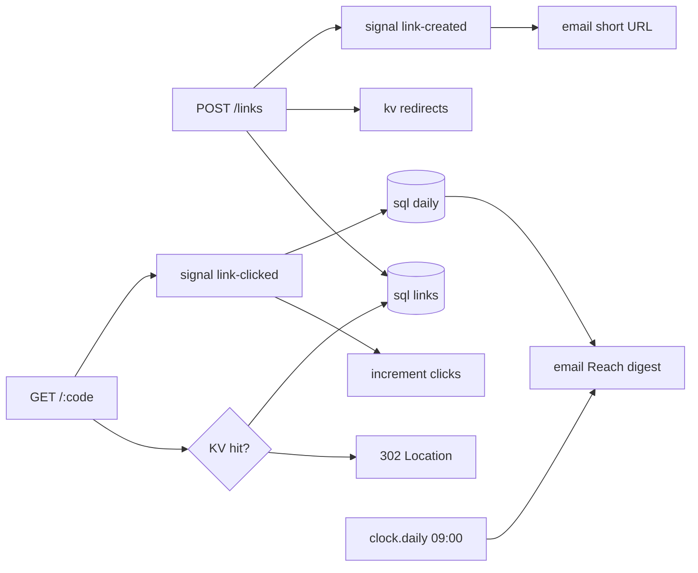

# Shorter (shorter)

Local-first [okengine](https://oke.omqkhafi.dev) starter: a **URL shortener** with
email/password auth, owner authorization, public 302 redirects, and Reach
(Channel + Clock click digest). This is a scaffold — every Flow and table here
is real wiring you keep or replace.

```bash
bun install
bun run dev       # or: bunx oke dev  — auto db push; asks once whether to seed
```

| Surface | URL |
| ------- | --- |
| Backend | http://127.0.0.1:6530 |
| Console | http://127.0.0.1:6533 |
| MCP | http://127.0.0.1:6535 |

## Try it

Register, then create a short link (Bearer token from `/auth/*`):

```bash
curl -s http://127.0.0.1:6530/health
curl -s -X POST http://127.0.0.1:6530/links \
  -H 'content-type: application/json' \
  -H 'authorization: Bearer <access>' \
  -d '{"url":"https://oke.omqkhafi.dev"}'
curl -sI http://127.0.0.1:6530/<code>
```

Flow names in the `oke dev` log are stable (`main.health`, `links.create`,
`links.redirect`, …) — never anonymous `flow_1`.

## Architecture

Every backend behavior is a Flow: `on(Trigger) → Effects`. There is no separate
species called endpoints, jobs, or subscribers.

Shorter is a working shortener, not a tour of every OKE surface. **Reach** is the
composition that shows the eight elements together: Channel + Clock + Store.



### HTTP map

Static paths (`/`, `/health`, `/links`, `/auth`) win over `GET /:code`. Custom
aliases cannot be `health`, `links`, or `auth`.

| Flow | Trigger | Gate | What it does |
| ---- | ------- | ---- | ------------ |
| `links.create` | `POST /links` | `linksMutate` | Persist URL + code + `userId`. Optional custom `code` / `expiresAt`. Auto code is 8-char `okid`. Emit `link-created`. KV cache. |
| `links.redirect` | `GET /:code` | `linksRedirect` | KV then SQL. Archived / missing / expired → `NotFound`. Else **raw** `302` + `Location` and emit `link-clicked`. |
| `links.list` | `GET /links` | `member` | Own rows only (`fx.json.withQuery`). |
| `links.get` | `GET /links/:code` | `member` | Own row; `Forbidden` if `userId` mismatches. |
| `links.archive` | `POST /links/:code/archive` | `linksMutate` | Owner-checked soft-disable; drop KV key. |
| `links.report` | `GET /links/:code/report` | `member` | Owner-checked per-day click rows. |
| `main.root` | `GET /` | public | Welcome JSON. |
| `main.health` | `GET /health` | public | `{ ok: true }`. |

`/auth/*` (register / login / session) comes from `gate.auth` with
`emailAndPassword` — no cookies, passkey, CSRF, or CORS.

Redirects return a raw `Response` so the kernel does not wrap `{ data, error }`:

```ts
return new Response(null, { status: 302, headers: { Location: url } });
```

### AuthZ — identity on the trigger, ownership in `do`

Gates live in `src/gate.ts` (`member`, `linksWriteRate` 60/min per user,
`linksMutate = member + rate`, `linksRedirect = public + 300/min per IP`).
Policies cannot touch Store, so owner checks for get / archive / report run
in Flow `do` (`fail("Forbidden")`). Create stamps `fx.auth.userId`. Redirects
stay anonymous and rate-limited by IP.

SQL RLS is **insert-only** (`policy.gate("member")` + `policy.owner("userId")`).
`for: "all"` would hide rows from public `GET /:code` and from
`links.onClicked` / `links.expire`, which UPDATE with no signed-in user.

### Data

| Table | Role |
| ----- | ---- |
| `links` | `id` PK, unique `code`, `url`, `userId`, `clicks`, optional `expiresAt` / `archivedAt` |
| `daily` | Per-code UTC day totals; `code` FK → `links.code` `onDelete: "cascade"` |

Relations are Drizzle v2 (`store.schema.relations`). `store.kv("redirects")`
caches `code → { url, expiresAt }` with TTL `24h` (Redis in Docker, memory in
tests).

### Off the hot path

| Flow | Trigger | What it does |
| ---- | ------- | ------------ |
| `links.onCreated` | `link-created` | Email the short URL + destination to `you@localhost`. |
| `links.onClicked` | `link-clicked` | Lookup by `code`, then `increment(links, row.id, "clicks")` — increment is the **PK**, not the unique code. Upsert `daily`. |
| `links.expire` | `clock.every("links.expire", "1h")` | Archive past `expiresAt`; drop KV keys. |
| `links.reach` | `clock.daily("links.reach", { at: "09:00" })` | Operator plane. Sum yesterday’s `daily` grouped by owner; one `reach-digest` email to `you@localhost`. |

A clock Flow has no `fx.auth` email — Reach is one digest to the demo inbox, not
per-owner SMTP. Mailpit locally (`drivers.channel.email` / `images.channel.email`).
Subject/body for both templates live in `oke({ channel.catalog })` in `src/app.ts`.

## Included vs you build

| Ships ready | You still own |
| ----------- | ------------- |
| `main.health` + links CRUD / redirect | your domain Flows and routes |
| `links` + `daily` tables + `oke db seed` | schema growth and seed policy |
| `link-created` + Reach digest email + catalog | delivery rules, more channels |
| `member` / `linksMutate` / `linksRedirect` gates | extra policies as needed |
| `.github/workflows/ci.yml` (typecheck + test) | lint, docker, deploy when you need them |

Out of this starter: MCP tools, AI slugs, unfurl, QR/files, Meilisearch,
passkey / CSRF / CORS, `store.resource` CRUD, live SSE, SMS/WhatsApp.

## Layout

| Path | Role |
| ---- | ---- |
| `src/app.ts` | `oke({ name, secrets, gate.auth, channel.catalog })` |
| `src/core.ts` | store · KV · re-exports |
| `src/email.ts` | Channel templates (`link-created` · `reach-digest`) |
| `src/gate.ts` | `member` · write throttle · public IP throttle |
| `src/vault.ts` | `SHORTER_VAULT` contracts |
| `src/db/schema.decl.ts` | `links` + `daily` + relations |
| `src/db/seed/` | `oke db seed` — sample short links |
| `src/db/migrations/` | versioned drizzle migrations |
| `src/flows/links/` | `shapes.ts` contracts · `_shared.ts` helpers · create · list · get · archive · report · redirect · Reach |
| `src/flows/main/` | root · health |
| `oke.config.ts` | local env · docker postgres (+ redis/s3/smtp); vault built-in |
| `.github/workflows/ci.yml` | `bun run typecheck` + `bun test` on push/PR |

`oke dev` always uses Docker Compose.

## AI

Not baked into this starter. Re-run create-oke with `--ai`, or `oke ai setup`, to
add `drivers.ai` + models in `src/core.ts`.
